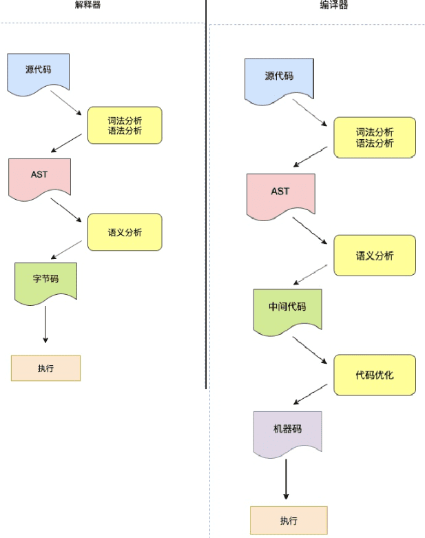

## 提升编译速度一些建议
* 检查依赖，减少不必要的依赖
* 分割代码为更小的块而不是一整陀的
* 尽可能推迟加载 JavaScript，按需要加载或者动态加载。
* 使用开发者工具和 DeviceTiming 来检测性能瓶颈
* 用像 Optimize.js 的工具来帮助解析器选择立即解析或者懒解析以加快解析速度

# 总结和基础
语言的虚拟机设计殊途同归，基本都是编译器，解释器，中间表示，分析，优化，生成代码，还有GC，以及运行时环境。但是其中的取舍各不相同。

`解析和编译过程的性能非常重要，因为 V8 只有等编译完成后才能运行代码,`V8执行js过程：
* 第一步:首先解析器会把源码解析为抽象语法树（Abstract Syntax Tree），这是用来表示源码的树形结构的对象，这个过程称为解析（Parsing），主要由 V8 的 Parser 模块实现。

* 第二步:解释器（Ignition）再将 AST 翻译为字节码，一边解释一边执行。
```
在此过程中，解释器会记特定代码片段的运行次数，如果代码运行次数超过某个阈值，那么该段代码就被标记为热代码（hot code），并将运行信息反馈给优化编译器（TurboFan）。

优化编译器根据反馈信息，优化并编译字节码，最终生成优化后的机器码，这样当该段代码再次执行时，解释器就直接使用优化机器码执行，不用再次解释，大大提高了代码运行效率。
```

### V8是如何执行代码


## 在线查看AST
https://astexplorer.net/
https://esprima.org/demo/parse.html
```js
function foo(x) {
    if (x > 10) {
        var a = 2;
        return a * x;
    }

    return x + 10;
}
```

window 系统里怎么使用 jsvu 工具快速调试 v8？
https://blog.csdn.net/kaimo313/article/details/125094742?spm=1001.2014.3001.5501
## 编译原理和AST
大部分东西都是 嵌套结构：各种网络协议的包格式，音频编码格式，视频h264......, html,xml, json, 文件夹，命令行，windows注册表，ini文件... 对象，字典,snmp oid.... 所有的这些东西本质都是一回事。如果你掌控能力足够强 是可以完全用if/else 加for 循环 加数组 这三个基本的东西实现上面的一切，但是遗憾的事大多人硬写的话掌控不住复杂的层层嵌套结构，进一步的技巧就是 状态机，再进一步想做的更加体系化，就要有编译原理的支持。  

AST什么的说直白了很简单，就是对整个代码文本中每一个括号，token,进行一个描述，包括location(在文本中的位置） ，类型（函数还是变量....），括号的配对者位置（block scope).....等等。 可以尝试硬写一个png的格式解析器；能掌控住的话，尝试下h264格式解析；如果还能掌控住，那么可以尝试html；如果依然没问题，可以尝试pdf ,或者解析js,总会到达一个需要编译原理理论支撑的阶段。

例如php是如何执行?
php是由解释器将脚本文件先翻译为操作码（opcode）, 然后从opcode找到对应的C函数，去执行该C函数。(这里的C函数在php安装成功之后就已经是机器码了。这块要分清楚。不要跟opcode混淆)

* 编译原理在基础软件和平台类软件中运用得比较多。基础软件如编译器和数据库，平台类软件如大数据框架等。

举个例子，对于数据库和大数据框架如Spark SQL等各种xx sql，本质都是将某种DSL，先经过词法分析，语法分析，语义分析等转化为某种中间表达，再将这种中间表达生成具体的执行任务，在这个过程中会用各种优化算法，来让任务执行的性能更高。这里面都会使用到编译技术。

再比如，Java后端面试中常见的框架和中间件也用到了编译技术，Hibernate中HQL的解析，分库分表中间件如shardingsphere对DSL的解析，Spring中对注解的支持，Java字节码动态生成都使用了编译原理的知识。

学好编译原理，能让你更好更快更强地设计和实现这些软件。能让你在看一些面试八股文时，不仅仅是背诵，也更加清楚怎么设计（即使你原先不知道这个软件，但你知道这个软件的功能，就能猜出它的大概实现）

* Java程序员面试必备JVM底层原理，学好了编译原理，JVM，V8，Go运行时等等，都是编译原理的具体实现，不用背，都能举一反三

* 进一步加深对算法的理解。比如编译原理中使用了大量的树和图相关的算法，编译后端指令选择算法BURS 算法是一种动态规划算法等等

* 编译原理是连接：程序，操作系统和计算机组成原理（也就是软硬件接口）的桥梁

## 字节码
* 字节码是平台无关的，机器码针对不同的平台都是不一样的
```
我觉的主要还是：对 v8 的代码进行重构，降低 v8 的代码复杂,毕竟字节码实现软件环境、与硬件环境无关，更好地进行v8的开发
```
* 字节码占用空间小，二进制机器码占用空间大。使用字节码所以能增强首次启动速度
* 源码转换为字节码时间消耗较短，生成二进制码时间消耗较长。

解释执行：V8在执行JavaScript源码时，会先通过解析器Parser将源码解析成AST，解释器Ignition会将AST转化为字节码，编译Turbofan一边解释一遍执行。

### Turbofan优化字节码解释慢
字节码缺点执行很慢，效率低。

在运行时编译代码的技术也被称为 JIT（即时编译），通过 JIT 可以极大提升 JavaScript 代码的执行性能。

即时编译：Ignition同时会记录某一代码片段的执行次数，如果执行次数超过了某个阈值，这段代码便会被标记为热点代码(HotSpot)，同时将运行信息反馈给优化编译器TurboFan，会将这部分热点代码的字节码优化并编译，生成机器码更高效地运行。

为了提高运行效率，v8提供了Object shapes和反馈向量槽功能，缓存函数中的对象类型。然后假设在对象类型不变的情况下将字节码编译成机器码加速执行。

## 基础
### 高级语言分为:
* 编译型语言：需要编译器进行一次编译，被编译过的文件可以多次执行。如 C++、C 语言。
* 解释型语言：不需要事先编译，通过解释器一边解释一边编译器编译执行。启动快，但执行慢。
JavaScript 没有像 C++那样可以事先提供足够的信息供编译器编译出更加低级的机器代码，它只能在运行阶段收集类型信息，然后根据这些信息进行编译再执行，所以 JavaScript 也是解释型语言。

从语言的角度分析JavaScript是动态语言，Java是静态语言。
对于静态语言，在编译时就已经知道数据类型而且在运行时类型不可变，就可以分配连续的内存空间给对象。而JavaScript运行过程中类型可变。 

JavaScript 要想被计算机执行，需要一个能够快速解析并且执行 JavaScript 脚本的引擎。

### 1.CPU 执行机器指令的流程?

### 2.编程语言是如何运行的? 解释器和编译器区别
处理器不能直接理解我们通过高级语言（如C++、Go、JavaScript等）编写的代码，只能理解机器码，所以在执行程序之前，需要经过一系列的步骤，将我们编写的代码翻译成机器语言。这个过程一般是由编译器（Compiler） 或者解释器（Interpreter） 来完成。

* 解释器:它将每个高级程序语句转换成机器代码。
* 编译器:把高级语言编写的程序转换成机器码，将人可读的代码转换成计算机可读的代码（0和1）。

机器语言:
一个机器语言程序是由一系列二进制模式组成的(例 110110) 它表示应该由计算机执行的简单操作。机器语言程序是可执行的，所以它们可以直接运行

区别：
两者都是将高级语言转换成机器码，
* 解释器在程序运行时将代码转换成机器码,编译的时候会把编译器会把文件都处理，生成一个目标文件
* 编译器在程序运行之前将代码转换成机器码,解析边处理源文件边执行

二者区别：


解释型语言(JavaScript、Python、Ruby)还是编译型语言(c#、Java、Rust)，都有一个共同的部分:将源代码作为纯文本解析为 抽象语法树(abstract syntax tree, AST) 的数据结构。

AST 源代码的抽象语法结构的树状表现形式，而且在语义分析中，编译器验证程序和语言元素的语法使用是否正确。
抽象语法树相对的是具体语法树（concrete syntaxtree），通常称作分析树（parse tree）。一般的，在源代码的翻译和编译过程中，语法分析器创建出分析树。一旦 AST 被创建出来，在后续的处理过程中，比如语义分析阶段，会添加一些信息。

为什么需要知道 JavaScript解析器工作原理?
通常情况下，浏览器解析 JavaScript 大约需占总执行时间的 15% 到 20%。

一个典型的单页程序加载 0.4 mb 左右的 JavaScript，浏览器需要大约 370ms 来解析它。也许你会又说，这也不是很多嘛，本身花费的时间并不多。但请记住，这只是将 JavaScript 代码解析为 AST 所需要的时间。这并不包括运行本身的时间，也不包括在页面加载 ，如 CSS 和 HTML 渲染过程的耗时。这些还只涉及桌面，移动浏览器的情况会更加复杂，在手机上花在解析上的时间通常是桌面浏览器的 2 到 5 倍。


好事就是 JavaScript 引擎做了很多工作来避免冗余的工作，并得到了更好的优化，以下为主流浏览器使用的技术。

例如，V8 实现脚本流(script streaming)和代码缓存技术。脚本流即脚本一旦开始下载，async 和 deferred的 脚本就会在单独的线程上解析。这意味着在下载脚本完成后几乎立即完成解析，这会提升 10% 的页面加载速度。

每次访问页面时，JavaScript 代码通常编译为字节码。 然而，一旦用户访问另一页面，该字节码就被丢弃。 发生这种情况是因为编译后的代码很大程度上依赖于编译时机器的状态和上下文。 这是 Chrome 42 引入字节码缓存的原因。 该技术会本地缓存编译过的代码，这样当用户返回同一页面时，诸如下载，解析和编译等所有步骤都会被跳过。 这使得 Chrome 可以节省大约 40％ 的解析和编译时间。 此外，这还可以节省移动设备的电量。


现代JavaScript 解析器使用立即解析会运行需要立即编译的函数。它主要做三件事:构建 AST，构建作用域层级和查找所有语法错误。另一方面， 懒解析只运行未编译的函数。它不构建AST，也不查找所有语法错误，它只构建作用域层级，与立即解析相比节省了大约一半的时间。

### 关于预解析
那么为什么解析器不都使用懒解析呢? 如果懒解析某些代码，这些代码需要立即执行，这实际上会使代码运行速度变慢。需要运行一次懒解析之后进行另一个立即解析，这和立即解析相比，运行速度会慢 50%。

以通过显式地声明立即执行的函数来帮助解析器加快解析速度。
```js
function foo(x) {
    return x * 10;
}
```
因为没有明显地标识表明需要立即运行该函数所以浏览器会进行懒解析。
```js
var foo = function foo(x) {
    return x * 10;
};
// 注意，这里有使用函数的名称 foo,这不是必需的，但是建议这样做，因为在抛出异常的情况下，stacktrace 会保留实际函数名称，而不仅仅是 <anonymous>。
```

用括号封装起来，让解析器进行立即解析：
现在，解析器看见 function 关键字前的左括号便会立即进行解析。
```js
var foo = (function foo(x) {
    return x * 10;
});
```

这种地让代码更难阅读和理解。可以使用 Optimize.js 可以帮我们做这类事情，该工具只是用来优化 JavaScript 源代码的初始加载时间，它们对代码进行静态分析，然后通过使用括号封装需要立即运行的函数以便浏览器立即解析并准备运行它们。

# Parser语法分析器-->AST


AST是一个内部结构，它是编译系统的一个中间结果，各个语言工具的实现不同。ast和编译器的后续步骤相关联。编译器怎么算精通，这个可以学习编译原理，学学llvm

为什么要转化为AST：高级语言是开发者可以理解的语言，但是让编译器或者解释器来理解就很困难，对于他们来说，能理解的就是AST，所以无论你使用的是解释型语言还是编译型语言，在编译的过程中，他们都会生成一个AST,比如Babel、ESLint

AST的作用：是一种非常重要的数据结构，有着广泛的应用。
1. 其中最常见的就是babel，babel是一个被广泛使用的代码转换器，可以将ES6代码转化为ES5代码，通过这样的方式可以解决有的浏览器无法ES6的语法的问题，而babel的转换原理就是先将ES6源码转化为AST，然后在将ES6语法的AST转化为ES5语法的AST，最后再利用ES5的AST生成JavaScript源代码
2. eslint也使用AST，其检测流程也需要将源代码转化为AST，然后再利用AST来检查代码的规范化问题

那么AST的生成过程是怎么样的呢？在Chrome中开始下载Javascript文件后，Parser就会开始并行在单独的线程上解析代码。解析可以在下载完成后仅几毫秒内完成，并生成AST。
AST的生成过程
1. 词法分析，又称分词（tokenize）,就是将一行行的源码拆解成为一个个token（指语法上不可能在分的，最小的单个字符或字符串）
2. 语法分析，又称解析（parse），作用是将上一步生成的token数据，根据语法规则转为AST，如果源码符合语法规则，则这一步就会顺利完成，但是如果源码存在语法错误，这一步就会终止，并且抛出一个语法错误

## 步骤1.
执行 JavaScript 代码之前，V8 就准备好了代码的运行时环境。 这个环境包括了:
* 栈空间和堆空间,V8 初始化了基础的存储空间之后，接下来就需要初始化全局执行上下文和全局作用域了，这两个内容是V8执行后续流程的基础。
* 全局执行上下文
* 全局作用域
* 消息队列与事件循环系统
* 以及全局函数，WebAPI 等内置资源

### 1.空间
栈空间
栈空间主要是用来管理 JavaScript 函数调用的，栈是内存中连续的一块空间，同时栈结构是“先进后出”的策略。在函数调用过程中，涉及到上下文相关的内容都会存放在栈上，比如原生类型、引用到的对象的地址、函数的执行状态、this 值等都会存在在栈上。当一个函数执行结束，那么该函数的执行上下文便会被销毁掉。

栈空间的最大的特点是空间连续，所以在栈中每个元素的地址都是固定的，因此栈空间的查找效率非常高，但是通常在内存中，很难分配到一块很大的连续空间，因此，V8 对栈空间的大小做了限制，如果函数调用层过深，那么 V8 就有可能抛出栈溢出的错误。

栈空间用来管理 JavaScript 调用。每一段 JavaScript 代码（一段脚本，或一个函数），V8 在编译阶段会生成执行这段代码的执行环境，也叫做执行上下文。JavaScript 使用栈来管理执行上下文。编译代码时入栈，执行完成后出栈。
栈空间的最大特点是内存连续，因此栈空间的操作效率非常高。但因为内存中很难分配到一大段连续的空间，因此栈空间通常很小。

堆空间
如果有一些内存占用比较大的数据，或者不需要存储在连续空间中的数据，栈空间就不适合使用。于是 V8 使用了堆空间。
堆空间是一种树形的存储结构，用来存储对象类型的离散的数据。JavaScript 除了原生类型以外，其他的对象类型，诸如函数，数组，浏览器的 window 对象，document 对象等，都是存储在堆空间。


## 初始化3.构造事件循环与消息队列
V8 是寄生在宿主环境中的，本身没有自己的主线程，而是使用宿主环境提供的主线程，V8 自身，与 V8 执行的代码，都运行在宿主环境的主线程。

只有一个主线程是不够的，当一个线程的代码执行完成后，线程就自动退出了，下次使用时又要重新启动线程，初始化数据。严重影响运行效率。

因此，主线程需要一个消息队列，存放 V8 内部的，页面响应的，JavaScript 触发的各种任务；还需要一个事件循环，不断地从消息队列中取出任务来执行


# 步骤1.惰性编译-对于不是立即执行的函数，只进行预解析
见：01-步骤1-预解析-变量提升.md

# 步骤2.初始环境准备好以后->解析阶段
整个解析过程可分为两部分: 

* 词法分析: 用于将代码拆分为 “最小的，不可分割的单位”，它被叫做 “token”。比如关键字 for, if，和一些直接量，如 123 这样的数字。
* 语法分析: 语法分析用于将已经拆分后的 token ，生成抽象语法树（AST）。之后，再根据 AST `生成执行上下文和作用域。`

### 2-1.词法分析
将字符流转换为 tokens，字符流就是我们编写的一行行代码，token 是指语法上不能再分割的最小单位，可能是单个字符，也可能是字符串，图中的 Scanner 就是 V8 的词法分析器。

在 V8 中，Scanner 负责接收 Unicode 字符流，并将其解析为 tokens，提供给解析器使用。比如 var a = 1; 这行代码，经过词法分析后的 tokens 就是下面这样：

可以看到， var a = 1; 这样一行代码包括 5 个 tokens：
* 关键字 var
* 标识符 name
* 赋值运算符  =
* 分割符 ;
```js
[
    {
        "type": "Keyword",
        "value": "var"
    },
        {
        "type": "Identifier",
        "value": "a"
    },
    {
        "type": "Punctuator",
        "value": "="
    },
    {
        "type": "Numeric",
        "value": "1"
    },
    {
        "type": "Punctuator",
        "value": ";"
    }
]
```

### 2-2.语法分析-->AST
将前面生成的token流根据语法规则，形成一个有元素层级嵌套的语法规则树，这个树就是AST。

根据语法规则，将 tokens 组成一个有嵌套层级的抽象语法结构树，这个树就是 AST，在此过程中，如果源码不符合语法规范，解析过程就会终止，并抛出语法错误。图中的 Parser 和 Pre-Parser 都是 V8 的语法分析器。

接下来， V8 的解析器会通过语法分析，根据 tokens 生成 AST， var a = 1; 这行代码生成的 AST 的 JSON 结构如下所示：
```json
{
  "type": "Program",
  "start": 0,
  "end": 10,
  "body": [
    {
      "type": "VariableDeclaration",
      "start": 0,
      "end": 10,
      "declarations": [
        {
          "type": "VariableDeclarator",
          "start": 4,
          "end": 9,
          "id": {
            "type": "Identifier",
            "start": 4,
            "end": 5,
            "name": "a"
          },
          "init": {
            "type": "Literal",
            "start": 8,
            "end": 9,
            "value": 1,
            "raw": "1"
          }
        }
      ],
      "kind": "var"
    }
  ],
  "sourceType": "module"
}
```
在astexplorer.net/中观察源码通过 Parser 转换后的 AST 的结构。

但是，对于一份 JavaScript 源码，如果所有源码在执行前都要完全经过解析才能执行，那必然会面临以下问题。

* 代码执行时间变长：一次性解析所有代码，必然会增加代码的运行时间。
* 消耗更多内存：解析完的 AST，以及根据 AST 编译后的字节码都会存放在内存中，必然会占用更多内存空间。
* 占用磁盘空间：编译后的代码会缓存在磁盘上，占用磁盘空间

所以，现在主流 JavaScript 引擎都实现了延迟解析（Lazy Parsing）。

# 步骤3.Ignition JS 字节码解释器 ->生成字节码
/iɡˈniSH(ə)n/
`有了 AST，执行上下文，作用域，就可以依据这些，由解释器生成字节码。`

* 解释器 Ignition 根据语法树生成字节码。Ignition是一台寄存器机器，每个字节码将其输入和输出指定为显式寄存器操作数，这与堆栈机器相反，在堆栈机器中，每个字节码将消耗输入并将输出推入隐式堆栈。

* TurboFan 是 V8 的优化编译器，TurboFan 将字节码生成优化的机器代码。

字节码就是介于AST和机器码之间的一种代码，但是与特定类型的机器码无关，字节码需要通过解释器将其转换为机器码之后才可以执行。如果字节码采用和物理 CPU 相同的计算模型进行设计，则将字节码编译为机器代码更容易。这就是为什么解释器（interpreter）常常是寄存器或堆栈。 Ignition 是具有累加器的寄存器。

为什么要使用字节码？
之前没有字节码的时候，是直接将AST转换为机器码，在最初的时候，执行机器码效率很高，这种方式在发布一段时间内运行效果非常的好，但是随着Chrome在手机上的广泛普及，内存占用问题也暴露出来，因为V8需要消耗大量的内存来存放转换后的机器码，为了解决内存占用问题，引入字节码

您可以将 V8 的字节码看作是小型的构建块（bytecodes as small building blocks），这些构建块组合在一起构成任何 JavaScript 功能。V8 有数以百计的字节码。比如 Add 或 TypeOf 这样的操作符，或者像 LdaNamedProperty 这样的属性加载符，还有很多类似的字节码。 V8还有一些非常特殊的字节码，如 CreateObjectLiteral 或 SuspendGenerator。头文件 bytecodes.h 定义了 V8 字节码的完整列表。
https://github.com/v8/v8/blob/master/src/interpreter/bytecodes.h

每个字节码指定其输入和输出作为寄存器操作数。Ignition 使用寄存器 r0，r1，r2，... 和累加器寄存器（accumulator register）。几乎所有的字节码都使用累加器寄存器。它像一个常规寄存器，除了字节码没有指定。 例如，Add r1 将寄存器 r1 中的值和累加器中的值进行加法运算。这使得字节码更短，节省内存。

许多字节码以 Lda 或 Sta 开头。Lda 和 Stastands 中的 a 为累加器（accumulator）。例如，LdaSmi [42] 将小整数（Smi）42 加载到累加器寄存器中。Star r0 将当前在累加器中的值存储在寄存器 r0 中。

以现在掌握的基础知识，花点时间来看一个具有实际功能的字节码。
```js
function incrementX(obj) {
  return 1 + obj.x;
}

incrementX({x: 42});
// V8 的编译器是惰性的，
// 如果一个函数没有运行，V8 将不会解释它
```

如果要查看 V8 的 JavaScript 字节码，可以使用在命令行参数中添加 --print-bytecode 运行 D8 或Node.js（8.3 或更高版本）来打印。对于 Chrome，请从命令行启动 Chrome，使用 --js-flags="--print-bytecode"
```
$ node --print-bytecode incrementX.js
...
[generating bytecode for function: incrementX]
Parameter count 2
Frame size 8
  12 E> 0x2ddf8802cf6e @    StackCheck
  19 S> 0x2ddf8802cf6f @    LdaSmi [1]
        0x2ddf8802cf71 @    Star r0
  34 E> 0x2ddf8802cf73 @    LdaNamedProperty a0, [0], [4]
  28 E> 0x2ddf8802cf77 @    Add r0, [6]
  36 S> 0x2ddf8802cf7a @    Return
Constant pool (size = 1)
0x2ddf8802cf21: [FixedArray] in OldSpace
 - map = 0x2ddfb2d02309 <Map(HOLEY_ELEMENTS)>
 - length: 1
           0: 0x2ddf8db91611 <String[1]: x>
Handler Table (size = 16)
```

这是每个字节码的意思，每一行：
* LdaSmi [1]  将常量 1 加载到累加器中。
* Star r0  将当前在累加器中的值 1 存储在寄存器 r0 中。
* LdaNamedProperty a0, [0], [4],LdaNamedProperty 将 a0 的命名属性加载到累加器中。ai 指向 incrementX() 的第 i 个参数。在这个例子中，我们在 a0 上查找一个命名属性，这是 incrementX() 的第一个参数。该属性名由常量 0 确定。LdaNamedProperty 使用 0 在单独的表中查找名称：
```
- length: 1
     0: 0x2ddf8db91611 <String[1]: x>
```
可以看到，0 映射到了 x。因此这行字节码的意思是加载 obj.x。

那么值为 4 的操作数是干什么的呢？ 它是函数 incrementX() 的反馈向量的索引。反馈向量包含用于性能优化的 runtime 信息。


* Return
Return 返回累加器中的值。返回语句是函数 incrementX() 的结束。此时 incrementX() 的调用者可以在累加器中获得值 43，并可以进一步处理此值。

乍一看，V8 的字节码看起来非常奇怪，特别是当我们打印出所有的额外信息。但是一旦你知道 Ignition 是一个带有累加器寄存器的寄存器，你就可以分析出大多数字节码都干了什么

# 步骤4.执行代码
边解释边执行

# 其他.JavaScript 的常见报错类型
1. SyntaxError 很常见，当语法不符合 JS 规范时，就会报这种错误
`SyntaxError 最为特殊，因为它是 编译阶段 抛出来的错误，如果发生语法错误，JS 代码一行都不会执行。而其他类型的异常都是 执行阶段 的错误，就算报错，也会执行异常之前的脚本。`
```js
const token = "ABC";
console.log(token);

//语法错误: Uncaught SyntaxError: Unexpected token '%'
const newToken = %((token);
```
2. ReferenceError 也很常见，打印一个不存在的值就是 ReferenceError,报错:编译错误
```js
doSomething();

function doSomething(){
  var test = 1
	console.log("How you doing?",b); // Uncaught ReferenceError: b is not defined
}
console.log('test:',test)
```
3. TypeError 当一个基础类型当作函数来用时，就会报这个错误：
4. RangeError
```js
// 这类错误很常见，例如栈溢出就是 RangeError；
function a () {
  b()
}
function b () {
  a()
}
a()

// out: 
// RangeError: Maximum call stack size exceeded
```