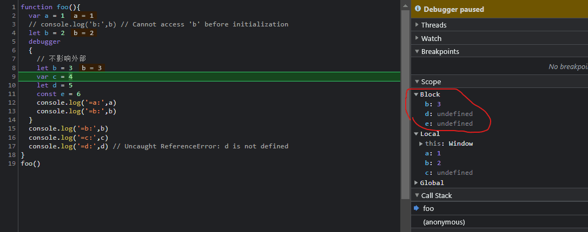

# 作用域
* 作用域是指在程序中定义变量的区域，该位置决定了变量的生命周期。即作用域控制着变量和函数的可见性和生命周期。
* 作用域是一套规则,用于确定在何处以及如何查找变量(标识符)。
* 作用域规定了如何查找变量，也就是确定当前执行代码对变量的访问权限。
* 作用域，就是你的方法或者变量可访问的区域。

作用域回答这样一些问题：一段代码可以在哪里访问？哪里不能访问？代码哪些部分可以被访问，哪些部分不能？

### 作用域分为两种主要的工作模型:第一种是词法作用域(静态作用域);另外一种叫作动态作用域
* JavaScript 采用词法作用域(lexical scoping)，也就是静态作用域。作用域大部分时候是静态作用域这是因为作用域的嵌套关系可以在语法分析时确定,而不必等到运行时确定。
```
词法作用域就是定义在词法阶段的作用域。换句话说,词法作用域是由你在代码时将变量和快作用域写在哪里决定的,作用域在编译的时候已经决定了,不会再修改。
某个函数是在哪声明的，就具有它所在位置的作用域。它能够访问哪些变量，那么就跟这些变量绑定了，在运行时就一直能访问这些变量。即静态作用域可以由程序代码决定，在编译时就能完全确定。大多数语言都是静态作用域的。
```

* 1.扩展：动态作用域是是通过运行时就行修改的,就是前面讲到的eval语法和with语法,这会导致性能下降。
```
动态作用域（Dynamic Scope）。也就是说，变量引用跟变量声明不是在编译时就绑定死了的。在运行时，它是在运行环境中动态地找一个相同名称的变量。在 macOS 或 Linux 中用的 bash 脚本语言，就是动态作用域的。
```

### 什么是作用域链?
在JS引擎中: 函数在执行的过程中，先从自己内部找变量如果找不到，再从创建当前函数所在的作用域(词法作用域)去找, 以此往上注意找的是变量的当前的状态。
作用域链决定了一段代码对于代码库中其他一些代码来说的可访问性。作用域链就是通过作用域一层一层的往上找,直到查找到顶层(全局作用域),可能找到,也可能没找到,但无论如何查找过程都将终止,因为全局作用域外层作用域的指向为null。

如果函数被定义在另一个函数内部，处在内部的函数可以访问自己内部的代码以及外部函数（父函数）的代码。`这种行为被称作词法作用域查找。`但外部函数并不能访问内部函数的代码。

## 三种作用域:JavaScript一共支持三种类型的作用域，它们分别是：
* 1.全局作用域,全局作用域中的对象在代码中的任何地方都能访问，其生命周期伴随着页面的生命周期。
```
每当 JavaScript 引擎接收到脚本文件时，它首先会创建一个默认的执行上下文，称为 全局执行上下文 (GEC)

GEC是基础/默认的执行上下文，所有 不在函数内部的JavaScript代码都在这里执行。每一个JavaScript文件只能有一个GEC。
```

* 2.函数作用域,函数内部定义的变量或者函数，并且定义的变量或者函数只能在函数内部被访问。函数执行结束之后，函数内部定义的变量会被销毁。
```
概念2.函数执行上下文（FEC)
每当函数被调用时，JavaScript引擎就会在GEC内部创建另一种执行上下文，称为函数执行上下文（FEC），并在FEC中评估和执行函数中的代码。

因为每个函数调用都创建自己的FEC，所以在脚本运行期间会有多个FEC。
```

* 3.块级作用域,使用一对大括号包裹的一段代码，比如函数、判断语句、循环语句，甚至单独的一个{}都可以被看作是一个块级作用域。

## 变量的查找:作用域链与上下文变量的结合
```js
var a1 = 1

function testA() {
  var a1 = 2
  testB();
}

function testB() {
  console.log(a1); // 输出:1,可见不是沿着调用栈一层一层往上找！而是作用域链
}

debugger
testA();
```
当代码执行到 testB 这个位置时，它位于调用栈的栈顶，此时 testA 和全局上下文都稳稳地坐在调用栈底部 —— 这首先为 testB 查找到自由变量创造了可能性。

在执行阶段，如果像例子中的 testB 一样，`在函数作用域内部找不到 a1 这个变量，那么引擎会沿着作用域链向上找`、定位到它对应的父级作用域的上下文、看有没有目标变量，如果还没有，那么就沿着作用域链继续往上定位、直到找到window（最底层）。如果window也没有 a1 这个变量，那么JS 会抛出引用错误 Uncaught ReferenceError: a1 is not defined

沿着作用域链找，可不是沿着调用栈一层一层往上找。调用栈是在执行的过程中形成的，而`作用域链可是在书写阶段就决定了`。因此，testB 里找不到的变量，绝不会去 testA 里找，而是去全局上下文变量里找。


### 理解作用域:为什么输出的不是f2？
```js
var scope = 'top';
var f1 = function () {
  console.log(scope);
};
f1(); // 输出 top
var f2 = function () {
  var scope = 'f2';
  f1();
};
debugger
f2(); // 输出 top

// 要想输出f2得这样写
var scope = 'top';
var f1 = function () {
  console.log(scope);
};
f1(); // 输出 top
function f2() {
  var scope = 'f2';
  return function f1() {
    console.log(scope);
  }
};
f2()(); // 输出 f2
```

很多人会理所当然的认为会打印出f2来，会说f2是个function，js是个以function为作用域划分，然而事情往往事与愿违---最后打印出的是出乎意料的top。人人都知道js在执行之前会进行预处理（V8处理js还会先把它编程字节码），很多人只知道在预处理的时候会出现var变量的提升（es6的let就不会啦）和function一等公民的预先处理。

然而却忽略了作用域的处理:函数作用域的嵌套关系是定义时决定的,而不是调用时决定的,也就 是说,JavaScript 的作用域是静态作用域,又叫词法作用域,这是因为作用域的嵌套关系可 以在语法分析时确定,而不必等到运行时确定。

但是下面又是输入func 的1,func形成了闭包，看debugger:
```js
function func() {
  var a = 1;
  setTimeout(function () {
    console.log(a)
  }, 100);
}
debugger
func(); // 1
```

# JavaScript 是如何支持块级作用域
用let,const 声明出来的变量中都会在词法环境中存放，块级作用域是通过词法环境的栈结构来实现的;

而变量提升是通过变量环境来实现的，两者结合就同时支持变量提升和块级作用域;

在块作用域内，在初始化之前使用let,const变量，V8 限制了访问，这被称为“暂时性死区”,下面例子中截图中的block。如图，可见const,let都会提升，但是提前访问都会报错;且作用域内外不影响重复定义；引用该变量JavaScript引擎会抛出错误。
```js
// 下面的例子执行到这里将会报错
console.log('=d:',d)
```

在词法环境内部， 维护了一个小型栈结构。栈底是函数最外层的变量，进入一个作用域块后，就会把该作用域块内部的变量压到栈顶；当作用域执行完成之后，该作用域的信息就会从栈顶弹出，这就是词法环境的结构,需要注意下，我这里所讲的变量是指通过let或者const声明的变量。

如图，可见const,let都会提升，但是提前访问都会报错;且作用域内外不影响重复定义；
当进入函数的作用域块时，`作用域块`中通过 let 声明的变量，会被存放在词法环境的一个单独的区域中，这个区域中的变量并不影响作用域块外面的变量。

初始化var提升


作用域暂时性锁区


```js
function foo(){
  var a = 1
  // console.log('b:',b) // Cannot access 'b' before initialization
  let b = 2
  debugger
  {
    // 不影响外部
    let b = 3
    var c = 4
    let d = 5
    const e = 6
    console.log('=a:',a)
    console.log('=b:',b)
  }
  console.log('=b:',b) 
  console.log('=c:',c)
  console.log('=d:',d) // Uncaught ReferenceError: d is not defined
}
foo()

// 例子2
let test= '123'
{
  console.log(test) // Uncaught ReferenceError: Cannot access 'test' before initialization
  let test= '345'
}
/*
在块级作用域中，从块级开始到结束之间会形成一个暂时性死区，如果中间去访问变量test，会报初始化之前不能访问test的错误。
*/
```
当执行上面这段代码的时候，JavaScript引擎会先对其进行编译并创建执行上下文，然后再按照顺序执行代码,例子中引入了let关键字，let关键字会创建块级作用域，那么let关键字是如何影响执行上下文的呢？

执行上下文示意图:


- 函数内部通过var声明的变量，在编译阶段全都被存放到变量环境里面了。
- 通过let声明的变量，在编译阶段会被存放到词法环境（Lexical Environment）中。
- 在函数的作用域内部，通过let声明的变量并没有被存放到词法环境中。

接下来，第二步继续执行代码，当执行到代码块里面时，变量环境中a的值已经被设置成了1，词法环境中b的值已经被设置成了2，这时候函数的执行上下文就如下图所示：

从图中可以看出，当进入函数的作用域块时，作用域块中通过let声明的变量，会被存放在词法环境的一个单独的区域中，这个区域中的变量并不影响作用域块外面的变量。

再接下来，当执行到作用域块中的console.log(a)这行代码时，就需要在词法环境和变量环境中查找变量a的值了，具体查找方式是：

沿着词法环境的栈顶向下查询，如果在词法环境中的某个块中查找到了，就直接返回给JavaScript引擎，如果没有查找到，那么继续在变量环境中查找。

### 例子:当查找变量时，先查找词法环境中的，如果没找到，再去变量环境中查找。
```js
function foo(){
  var a = 1
  let b = 2
  {
    let b = 3
    var c = 4
    // 初始化并没有被提升，在初始化之前使用变量，就会形成一个暂时性死区。
    console.log('=d:',d) // Uncaught ReferenceError: Cannot access 'd' before initialization
    let d = 5
  }
}
foo()

// to es5: 编译成es5是不会报错的
function foo() {
  var a = 1;
  var b = 2;
  {
    var _b = 3;
    var c = 4;
    console.log('=d:', d); // undefined
    var d = 5;
  }
}
foo();
```

### 例子:
全局作用域并且也赋值了，而在函数f1里面打印的还是undefined，这是因为函数形成的函数作用域，已经是一个封闭性的作用域，只要它里面存在此变量，将不会去访问外层作用域的相同变量了。
```js
var a = 10;
var b = 0;
function f1(){
    console.log('test1:',a); // undefined
    console.log('test2:',b); // 0
    var a = 20;     
    console.log(a); // 20
}
f1()
```

## 题目
```js
var b = 10;
(function b(){
    b = 20;
    console.log(b); 
})();

// ?
```

## 题目
下面代码中 a 在什么情况下会打印 1？
```js
var a = ?;
if(a == 1 && a == 2 && a == 3){
 	console.log(1);
}
```

下面代码输出什么
```js
var a = 10;
(function () {
    console.log(a)
    a = 5
    console.log(window.a)
    var a = 20;
    console.log(a)
})()
```

```js
因为==会进行隐式类型转换 所以我们重写toString方法就可以了
var a = {
  i: 1,
  toString() {
    return a.i++;
  }
}

if( a == 1 && a == 2 && a == 3 ) {
  console.log(1);
}
```