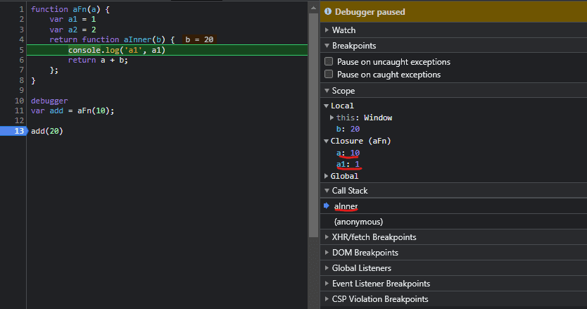
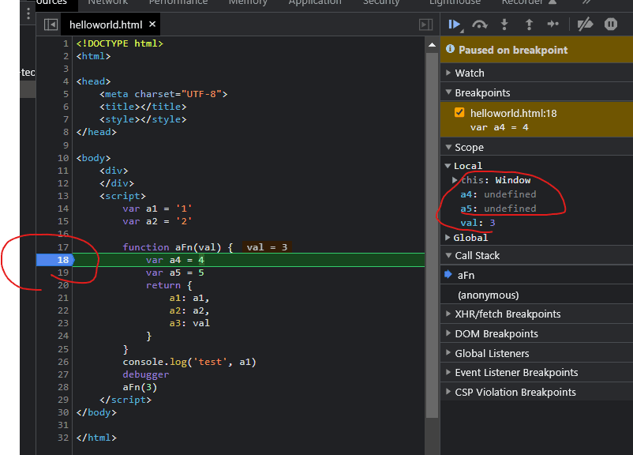
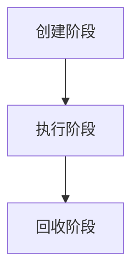
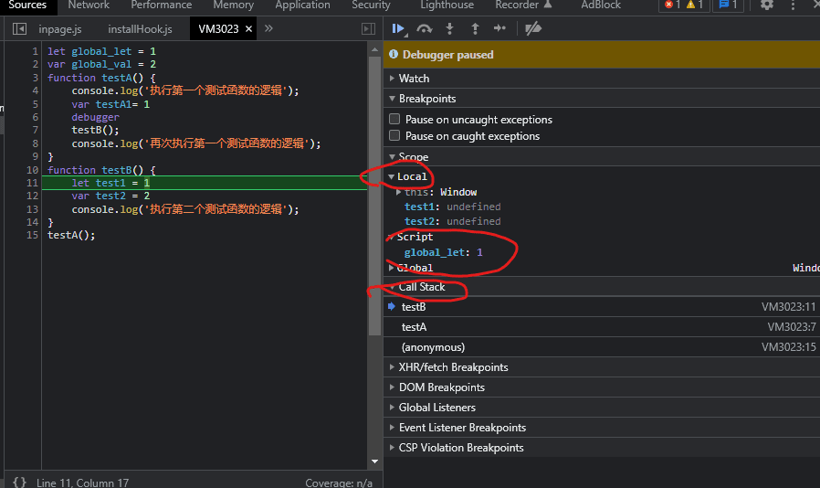
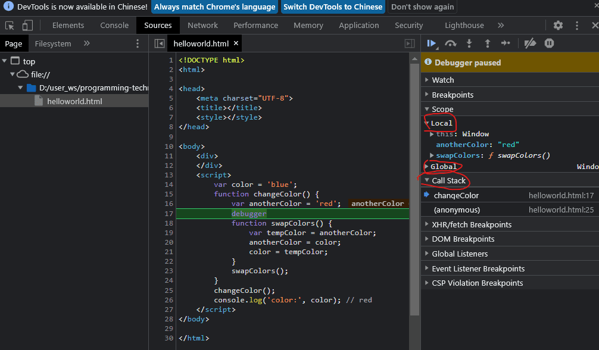
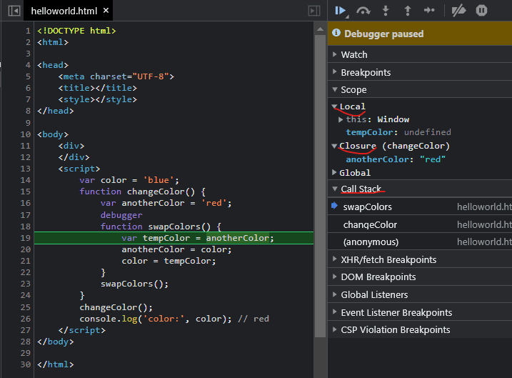
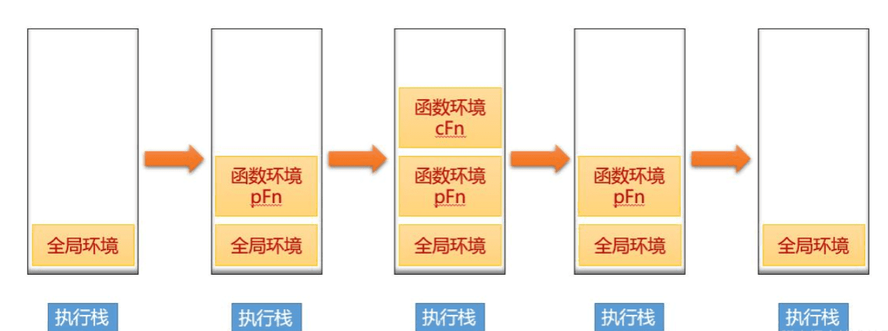

# 调用栈的角度，理解闭包
继续分析没被销毁原因：
在执行上下文的创建阶段，跟着被创建的还有作用域链！这个作用域链在函数中以内部属性的形式存在，在函数定义时，其对应的父变量对象就会被记录到这个内部属性里。闭包正是通过这一层作用域链的关系，实现了对父作用域执行上下文信息的保留。

`作用域在嵌套的情况下，外部作用域是不能访问内部作用域的变量的。一般来说，函数出栈后，我们都没有办法再访问到函数内部的变量了。但闭包可不是这样:`
```js
function aFn(a) {
    var a1 = 1
    var a2 = 2
    return function aInner(b) {
        console.log('a1', a1)
        return a + b;
    };
}

debugger
var add = aFn(10);

add(20)
```
当执行到`add(20)`闭包让函数的执行上下文存在aFn的执行上下文a,a1，aFn的a,a1没被销毁,但是a2已经被销毁


当执行到add,看截图add:ƒ aInner(b),并不是指向初始化的：add:undefined


当add执行的时候，调用的是aInner(),可见Closure-闭合/闭包：
```js
{
    a: 10
    a1: 1
}
```

# 前言:执行上下文
理解闭包就不得不去理解作用域和执行上下文，理解this得理解词法作用域规则。

闭包、this可以把它们放在一个完整的知识链路里来理解，那就是JS 的执行上下文。
`闭包的本质:`
作用域大部分时候是静态作用域,又叫词法作用域,这是因为作用域的嵌套关系可以在语法分析时确定;

闭包保持着对父函数得作用域引用，这在语法分析已经确定，父级函数的执行上下文在运行时赋值，所以闭包return的值就是执行上下文赋值的值，也就是父级函数执行之后不会销毁引用的作用域。

`理解执行上下文和执行栈对于理解其他 JavaScript 概念（如变量声明提升，作用域和闭包）至关重要。`

### 定义:三种上下文
* 1.全局执行上下文：只有一个，浏览器中的全局对象就是 window 对象，this 指向这个全局对象。

* 2.函数执行上下文：存在无数个，只有在函数被调用的时候才会被创建，每次调用函数都会创建一个新的执行上下文。函数作用域是在函数声明的时候就已经确定了，而函数执行上下文是在函数调用时创建的。

* 3.Eval 函数执行上下文： 指的是运行在 eval 函数中的代码，很少用而且不建议使用。

### 函数执行上下文
它在机制层面和全局上下文高度一致，各位只需要关注它与全局上下文之间的不同即可。两者之间的不同主要体现在以下方面上：
* 创建的时机:全局上下文在进入脚本之初就被创建，而函数上下文则是在函数调用时被创建
* 创建的频率:全局上下文仅在代码刚开始被解释的时候创建一次；而函数上下文由脚本里函数调用的多少决定，理论上可以创建无数次
* 创建阶段的工作内容不完全相同,函数上下文不会创建全局对象（Window），而是创建参数对象（arguments）；创建出的 this 不再死死指向全局对象，而是取决于该函数是如何被调用的,如果它被一个引用对象调用，那么 this 就指向这个对象；

对比:
全局执行上下文:
* 创建一个全局变量对象存储函数和变量声明。
* 创建 `this` 对象将全局作用域中所有变量和函数作为属性和方法存储。
* 不可以访问函数上下文中的代码

函数执行上下文:
* 并不创建全局变量对象。相反，创建arguments对象存储所有传入函数的参数。
* 不创建`this` 对象，但可以访问被定义的环境，通常情况下为 `window` 对象。
* 通过作用域查找，可以访问上下文以及父上下文中的代码（变量和函数）。

debugger 进入 aFn(),会进入函数上下文的创建阶段，在这个阶段里，函数上下文的内容如下：
```js
var a1 = '1'
var a2 = '2'

function aFn(val) {
    var a4 = 4
    var a5 = 5
    return {
        a1: a1,
        a2: a2,
        a3: val
    }
}
console.log('test', a1)
debugger
aFn(3)
```
```js
Phase: Creation

arguments: {length: 1}

a1: 4

a2: 5

this: window
```



## 执行上下文的生命周期

### 执行上下文是在编译阶段就被确定了的，但是执行的时候会被赋值修改，所以分为
* 1.创建阶段
* 2.执行阶段

执行上下文 包含了变量、函数声明，参数（arguments），作用域链，this等信息,一个执行上下文会包含以下内容：
* 变量环境:var，function 变量存放在变量环境
* 词法环境:包含了使用 let、const 等变量的内容。
* this 指针,this指的是执行上下文所属的作用域。一旦作用域链被创建，JS引擎就会初始化this关键字的值。

执行上下文例子：
```js
function fn(a,b){
  debugger
  var a1 = 1
  let sum = a + b

  function test(){
    console.log('innerFn')
  }
}
fn(1,2)
```


注意:执行上下文是在编译阶段创建并入栈的,即便代码没有执行。但 let，var 这些变量的声明都已经被提升，只是 let，const，这些词法环境的变量，只提升声明，不提升初始化，因此，V8 限制了访问，这被称为“暂时性死区”。

### 详细解答执行上下文
ES5 规范去除了 ES3 中变量对象和活动对象，以词法环境组件(LexicalEnvironment component）和变量环境组件（VariableEnvironment component）替代。

es5 执行上下文的生命周期也包括三个阶段：

* 创建阶段 —— 执行上下文的初始化状态，此时一行代码都还没有执行，只是做了一些准备工作
* 执行阶段 —— 逐行执行脚本里的代码

Phase: Creation 就是创建阶段的全局上下文概览。为啥这时候变量没有值呢？这是因为创建阶段里，JS 引擎不多不少只做这么几件事：
1. 创建全局对象（Window/Global）
2. 创建 this ，并让它指向全局对象,也被称为 This Binding
3. LexicalEnvironment（词法环境） 组件被创建
4. VariableEnvironment（变量环境） 组件被创建
3. 给变量和函数安排内存空间
4. 默认给变量赋值为 undefined；将函数声明放入内存
创建作用域链

### 2.`创建词法环境`,词法环境的结构如下：
```js
GlobalExecutionContext = {  // 全局执行上下文
  LexicalEnvironment: {     // 词法环境
    EnvironmentRecord: {    // 环境记录
      Type: "Object",       // 全局环境
      // 标识符绑定在这里 
      outer: <null>         // 对外部环境的引用
  }  
}
 
FunctionExecutionContext = { // 函数执行上下文
  LexicalEnvironment: {     // 词法环境
    EnvironmentRecord: {    // 环境记录
      Type: "Declarative",      // 函数环境
      // 标识符绑定在这里      // 对外部环境的引用
      outer: <Global or outer function environment reference>  
  }  
}
```

词法环境有两种类型:
1. 全局环境：是一个没有外部环境的词法环境，其外部环境引用为 null。拥有一个全局对象（window 对象）及其关联的方法和属性（例如数组方法）以及任何用户自定义的全局变量，this 的值指向这个全局对象。

2. 函数环境：用户在函数中定义的变量被存储在环境记录中，包含了 arguments 对象。对外部环境的引用可以是全局环境，也可以是包含内部函数的外部函数环境。

词法环境有两个组件:
* 环境记录器：存储变量和函数声明的实际位置。
* 外部环境的引用：它指向作用域链的下一个对象，可以访问其父级词法环境

在函数环境中使用 声明式环境记录器，用来存储变量、函数和参数

### 3.创建变量环境
变量环境也是一个词法环境，因此它具有上面定义的词法环境的所有属性。

### 在 ES6 中，词法环境和 变量环境的区别在于:
* 词法环境用于存储函数声明和变量(let和const关键字)绑定，通过词法环境在函数作用域的基础上实现块级作用域。
```
使用 let / const 声明的全局变量，会被绑定到 Script 对象而不是 Window 对象，不能以Window.xx 的形式使用
```

* 变量环境仅用于存储变量(var)绑定，因此变量环境实现函数级作用域。
```
使用 var 声明的全局变量会被绑定到 Window 对象
```

* 使用 var / let / const 声明的局部变量都会被绑定到 Local 对象。
```
注：Script 对象、Window 对象、Local 对象三者是平行并列关系。
```

### 例子
```js
var a1 = '1'
var a2 = '2'

function aFn() {
    return {
        a1: a1,
        a2: a2
    }
}
console.log('test', a1)
```

js引擎对于我们是个黑盒，根据全局作用域的分析，创建阶段的执行上下文大概如下,可见发生在`预编译阶段`:
```js
Phase: Creation

window: global object

this: window

a1: undefined

a2: undefined

aFn: fn()
```


继续往下,执行阶段的全局上下文,看截图，当程序走到console,两个变量都已经赋值,因为 JS 引擎已经在一行一行执行代码、执行赋值操作了

```js
Phase: Execution

window: global object

this: window

a1: 1

a2: 2

aFn: fn()
```

所以变量提升的本质在于执行上下文的不同阶段，前者发生在预编译，后者发生在执行

## 调用栈
首次运行JS代码时，会创建一个全局执行上下文并Push到当前的执行栈中。每当发生函数调用，引擎都会为该函数创建一个新的函数执行上下文并Push到当前执行栈的栈顶。

函数执行完毕后，其对应的执行上下文也随之消失了叫做出栈，在 JS 代码的执行过程中，引擎会为我们创建“执行上下文栈”（也叫调用栈),当我们调用一个函数的时候，就会把它的上下文推入调用栈里，执行完毕后出栈，随后再为新的函数进行入栈操作。
```js
let global_let = 1
var global_val = 2
function testA() {
    console.log('执行第一个测试函数的逻辑');
    var testA1= 1
    debugger
    testB();
    console.log('再次执行第一个测试函数的逻辑');
}
function testB() {
    let test1 = 1
    var test2 = 2
    console.log('执行第二个测试函数的逻辑');
}
testA();
```
执行到testB:


执行到testB,回到testA中的console:


执行完回到了全局上下文，总结全过程：


### 调用栈例子
```js
var color = 'blue';
function changeColor() {
    var anotherColor = 'red';
    debugger
    function swapColors() {
        var tempColor = anotherColor;
        anotherColor = color;
        color = tempColor;
    }
    swapColors();
}
changeColor();
console.log('color:', color); // red
```
执行过程可以在 devTool 的 call stack 中看到，其中 anonymous 为全局上下文栈；其余为函数上下文栈

changeColor(),调用栈变成了2个：
* changeColor
* (anonymous)


当执行到swapColors(),调用栈变成了三个：
* swapColors 在栈顶
* changeColor
* (anonymous)


执行过程：

1. 首先创建了全局执行上下文，压入执行栈，其中的可执行代码开始执行。
2. 然后调用 changeColor 函数，JS引擎停止执行全局执行上下文，激活函数 changeColor 创建它自己的执行上下文，且把该函数上下文放入执行上下文栈顶，其中的可执行代码开始执行。
3. changeColor 调用了 swapColors 函数，此时暂停了 changeColor 的执行上下文，创建了 swapColors 函数的新执行上下文，且把该函数执行上下文放入执行上下文栈顶。
4. 当 swapColors 函数执行完后，其执行上下文从栈顶出栈，回到了 changeColor 执行上下文中继续执行。
5. changeColor 没有可执行代码，也没有再遇到其他执行上下文了，将其执行上下文从栈顶出栈，回到了 全局执行上下文 中继续执行。
6. 一旦所有代码执行完毕，JS引擎将从当前栈中移除 全局执行上下文。


```js
console.log(1);
function pFn() {
    console.log(2);
    (function cFn() {
        console.log(3);
    }());
    console.log(4);
}
pFn();
console.log(5);
//输出：1 2 3 4 5
```
先有全局环境下的执行上下文，调用pFn后将函数环境pFn的执行上下文压入栈中，由于pFn中执行了cFn函数，所以继续压入cFn函数的执行上下文，执行完毕后依次出栈。全局上下文只有应用程序退出前才会被销毁，比如关闭网页或者退出浏览器

