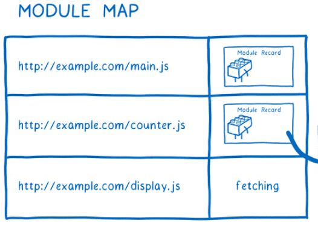

# esm

## 闭包跟模块之间的关系
根据闭包的生成条件与实践场景，模块中非常容易生成闭包。
每一个JS模块都可以认为是一个独立的作用域，当代码执行时，该词法作用域创建执行上下文，如果在模块内部，创建了可供外部引用访问的函数时，就为闭包的产生提供了条件，只要该函数在外部执行访问了模块内部的其他变量，闭包就会产生。

## 预编译
在编译期时，JS 解析器识别到 import b from './b'，就会生成一个引用 b，到了执行的时候，直接使用引用 b 了。
```js
import { readFile } from 'fs';
```
js 代码被 JavaScript 引擎编译时, 并将上面 fs 模块的属性 readFile 指向对应模块的

```js
export const readFile() // 方法上，注意这里只是做了指针指向，而并不是执行 fs 模块。
```

当执行 readFile() 时，就会去找指针指向的代码并执行。

## 预编译中的import 变量提升
demo1 - ES6
```js
// a.js
console.log('I am a.js...')
import { foo } from './b.js';
console.log(foo);

// b.js
console.log('I am b.js...')
export let foo = 1;

// 运行 node -r esm a.js
// I am b.js
// I am a.js
// 1
```
demo1 中因为 ES6 在语言标准层面上实现了模块功能，所以当对 a.js 预编译时发现关键词 import 后，会先去加载 b.js，所以先输出 'I am b.js'。a.js & b.js 预编译后的执行顺序如下，
```
整个流程是：预编译 a.js -> 发现关键词 import -> 预编译 b.js -> 执行 b.js -> 执行 a.js。
```

demo2 - CommonJS
```js
// a.js
console.log('I am a.js...')
var b = require('./b');
console.log(b.foo);

// b.js
console.log('I am b.js...')
let foo = 1;
module.exports = {
   foo: foo
}

// 运行 node a.js
// I am a.js
// I am b.js
// 1
```

demo2 中，对 a.js 预编译时，只会把变量 b 的声明提前，a.js & b.js 预编译后的执行顺序如下：
```js
// a.js
var b;
console.log('I am a.js...')
b = require('./b');
console.log(b.foo);

// b.js
console.log('I am b.js...')
let foo = 1;
module.exports = {
   foo: foo
}
```

## esm前言
当你在使用模块进行开发时，是在构建一张依赖关系图。不同模块之间的连线就代表了代码中的导入语句。

正是这些导入语句告诉浏览器或者 Node 该去加载哪些代码。
我们要做的是为依赖关系图指定一个入口文件。从这个入口文件开始，浏览器或者 Node 就会顺着导入语句找出所依赖的其他代码文件。

但是呢，浏览器并不能直接使用这些代码文件。它需要解析所有的文件，并把它们变成一种称为模块记录（Module Record）的数据结构。只有这样，它才知道代码文件中到底发生了什么。


解析之后，还需要把模块记录变成一个模块实例。模块实例会把代码和状态结合起来。状态是变量在任何时候的真实值。当然，变量实际上就是内存地址的别名，内存才是正在存储值的地方。

所以，可以看出，模块实例中代码和状态的结合，就是指令集和变量值的结合。

对于模块而言，我们真正需要的是模块实例。
模块加载会从入口文件开始，最终生成完整的模块实例关系图。对于 ES Module ，这个过程包含三个阶段：
1. 构建：查找，下载，然后把所有文件解析成模块记录。
2. 实例化：为所有模块分配内存空间（此刻还没有填充值），然后依照导出、导入语句把模块指向对应的内存地址。这个过程称为链接（Linking）。
3. 运行：运行代码，从而把内存空间填充为真实值。

ESM 标准 规范了如何把文件解析为模块记录，如何实例化和如何运行模块。但是它没有规范如何获取文件。

文件是由加载器来提取的，而加载器由另一个不同的标准所规范。对于浏览器来说，这个标准就是 HTML。
浏览器中ES Module是异步加载，不会堵塞浏览器，即等到整个页面渲染完，再执行模块脚本。如果网页有多个ESM，它们会按照在页面出现的顺序依次执行。
加载器也同时控制着如何加载模块。它会调用 ESM 的方法，包括 ParseModule、Module.Instantiate 和 Module.Evaluate 。它就像是控制着 JS 引擎的木偶。

## 步骤1.构造阶段
构造：查找、下载并解析所有文件到模块记录中。构造阶段最后生成根据依赖关系AST的 Module Record的依赖树，同时将每个Module Record映射保存到Module Map中。
对于每个模块，在构建阶段会做三个处理：

1. 确定要从哪里下载包含该模块的文件，也称为模块定位（Module Resolution）
2. 提取文件，通过从 URL 下载或者从文件系统加载
3. 解析每个module文件，生成 Module Record（包含当前module的AST、变量等）；
4. 将Module Record 映射到 Module Map中，保持每个module文件的唯一性；

### 解析模块
拿到了模块文件，我们需要把它解析为模块记录。


一旦模块记录创建完成，它就会被记录在模块映射中。所以，后续任何时候再次请求这个模块时，加载器就可以直接从模块映射中获取该模块。



解析过程中有一个看似微不足道的细节，但是实际造成的影响却很大。那就是所有的模块都按照严格模式来解析的。
也还有其他的小细节，比如，关键字 await 在模块的最顶层是保留字， this 的值为 undefined。

这种不同的解析方式称为解析目标（Parse Goal）。如果按照不同的解析目标来解析相同的文件，会得到不同的结果。因此，在解析文件之前，必须清楚地知道所解析的文件类型是什么，不管它是不是一个模块文件。

* 在浏览器中，知道文件类型是很简单的。只需要在`<script>`脚本中添加`type="module"`属性即可。这告诉浏览器这个文件需要被解析为一个模块。而且，因为只有模块才能被导入，所以浏览器以此推测所有的导入也都是模块文件
* 在 Node 中,社区提出一种解决办法是使用 .mjs 拓展名。使用该拓展名会告诉 Node 说“这是个模块文件”。

无论最终使用哪种方式，加载器都会决定是否把一个文件作为模块来解析。如果是模块，而且包含导入语句，那它会重新开始处理直至所有的文件都已提取和解析。

到这里，构建阶段差不多就完成了。在加载过程处理完成后，你已经从最开始只有一个入口文件，到现在得到了一堆模块记录。

下一步会实例化这些模块并且把所有的实例链接起来。

### 例子解析
例子：其中/src/main.ts是Vue3的入口文件。
```html
<!DOCTYPE html>
<html lang="en">
    <head>
        <meta charset="UTF-8" />
        <link rel="icon" href="favicon.png" />
        <meta name="viewport" content="width=device-width, initial-scale=1.0" />
        <title>xxxx</title>
    </head>
    <body>
        <div id="app"></div>
        <script type="module" src="/src/main.ts"></script>
    </body>
</html>
```
1. 以入口节点为根节点（如main.js）然后通过import代码去寻找与之关联的其他模块，形成一个依赖关系树（AST）。不同依赖项之间通过export\import语句来进行关联。

加载器要如何定位 main.js 直接依赖的模块呢？
这个时候导入语句就派上用场了。导入语句中有一部分称为模块定位符（Module Specifier），它会告诉加载器去哪定位模块。

解析文件前，需要一层一层地遍历树，找出它的依赖项，然后找到并加载这些依赖项；

解析：将文件解析为模块记录；
```js
把解析出来的模块构成表 称为 Module Record （模块记录）。

Module Record 包含了当前模块的 AST，引用了哪些模块的变量，以及一些特定属性和方法。

一旦 Module Record 被创建，它会被记录在模块映射Module Map中。被记录后，如果再有对相同 URL 的请求，Loader 将直接采用 Module Map 中 URL 对应的Module Record。
```


2. 生成 Module Record
浏览器无法直接使用文件本身，但是浏览器会解析这些文件，根据 import/export 语句构成模块记录(Module Record)，每个模块文件对应生成一个 Module Record，记录当前模块的信息：

3. 转化 Module Instance
模块记录转化为模块实例，浏览器最终能够读取也就是Module Instance。


在构造过程结束时，从主入口文件变成了一堆模块记录Module Record：


## 步骤2.实例化阶段：
实例化：在内存中寻找一块区域来存储所有导出的变量（但还没有填充值）。然后让 export 和 import 都指向这些内存块。这个过程叫做链接（linking）

实例化阶段确定了 export和import内存中的指向，同时该内存空间中定义了Module文件的变量（但是还未赋值）；
1. 生成模每个Module Record的块环境记录(Module Enviroment Record)，用来管理 Module Record 的变量等；
2. 在内存中写入每个Module的数据，同时 Module文件的导出export和引用文件的 import指向该地址；

模块实例包含两部分：代码、状态。状态存在于内存中，因此实例化步骤就是写入内存。

首先，JS引擎创建一个模块环境记录(Module Enviroment Record)来管理 Module Record 的变量。然后它在内存中找到所有导出内容对应的位置。模块环境记录将跟踪内存中导出内容对应的位置与导出内容间的联系。

这些内存地址此时还没有值，只有等到运行后它们才会被填充上实际值。有一点要注意，所有导出的函数声明都在这个阶段初始化，这会使得后面的运行阶段变得更加简单。

为了实例化模块关系图，引擎会采用深度优先的后序遍历方式。
即，它会顺着关系图到达最底端没有任何依赖的模块，然后设置它们的导出。


`这个过程跟 CJS 是不同的。在 CJS 中，整个导出对象在导出时都是值拷贝。即，所有的导出值都是拷贝值，而不是引用。所以，如果导出模块内导出的值改变了，导入模块中导入的值也不会改变。`


注意，导出和导入都指向内存中的同一位置。首先链接导出，可确保所有导入都可以链接到匹配的导出。
ESM 则使用称为实时绑定（Live Binding）的方式。导出和导入的模块都指向相同的内存地址（即值引用）。所以，当导出模块内导出的值改变后，导入模块中的值也实时改变了。


两个模块都指向内存中的相同位置。这意味着当导出模块更改值时，该更改将显示在导入模块中。导出值的模块可以随时更改这些值，但导入模块不能更改其导入的值，虽然有此限制，但是如果一个模块导入一个对象，导入模块中可以更改该对象上的属性值。

模块导出的值在任何时候都可以能发生改变，但是导入模块却不能改变它所导入的值，因为它是只读的。
举例来说，如果一个模块导入了一个对象，那么它只能改变该对象的属性，而不能改变对象本身。


```js
import { fn1, a1, obj } from './modul1.js'

function run() {
  console.log('run')
  // fn1()

  // 1.修改 a1的值会报错
  // a1 = 2

  // 2.但是对于对象的值可以修改
  obj.a2 = 3
  console.log('修改对象的值:', obj.a2)
}

run()

// 模块代码
function fn1() {
  console.log('fn1')
}

let a1 = 1
const obj = { a2: 2 }

console.log('=初始化会执行')

export { fn1, a1, obj }
```


`拥有这样的动态绑定可以使我们在不运行任何代码的情况下连接所有模块。`

ESM 采用这种实时绑定的原因是，引擎可以在不运行任何模块代码的情况下完成链接。后面会解释到，这对解决运行阶段的循环依赖问题也是有帮助的。

实例化阶段完成后，我们得到了所有模块实例，以及已完成链接的导入、导出值。

实例化结束时，已经连接了export/import变量的所有实例和内存位置。

现在我们可以开始运行代码并且往内存空间内填充值了。


## 步骤3.求值阶段：
最后一步，在内存区中填充绑定的数据的值。求值：在内存块中填入变量的实际值。


最后一步是往已申请好的内存空间中填入真实值。JS 引擎通过运行顶层代码（函数外的代码）来完成填充。

除了填充值以外，运行代码也会引发一些副作用（Side Effect）。例如，一个模块可能会向服务器发起请求

因为这些潜在副作用的存在，所以模块代码只能运行一次。
前面我们看到，实例化阶段中发生的链接可以多次进行，并且每次的结果都一样。但是，如果运行阶段进行多次的话，则可能会每次都得到不一样的结果。

这正是为什么会使用模块映射的原因之一。模块映射会以 URL 为索引来缓存模块，以确保每个模块只有一个模块记录。这保证了每个模块只会运行一次。跟实例化一样，运行阶段也采用深度优先的后序遍历方式。

加载了两次my_module，但是只会执行一次。
```js
import { foo } from 'my_module';
import { bar } from 'my_module';

// 等同于
import { foo, bar } from 'my_module';
```

那对于前面谈到的循环依赖会怎么处理呢？

循环依赖会使得依赖关系图中出现一个依赖环，即你依赖我，我也依赖你。通常来说，这个环会非常大。不过，为了解释好这个问题，这里我们举例一个简单的循环依赖。

1. 执行对应Module文件中顶层作用域的代码，确定实例化阶段中定义变量的值，放入内存中；

JS 引擎通过执行顶层代码（函数之外的代码，此处可以理解为模块文件中顶层作用域中的代码）来给内存区的引用赋值。

求值阶段确定了Module文件中变量的值，由于 ES Module使用的是动态绑定（指向内存地址），export中修改数据会映射到内存中，import数据相应也会改变。

总结：


## ESM 的加载细节
在讲解ESM 的加载细节之前，我们要了解 ESM 中也存在 变量提升 和 函数提升 ，意识到这一点非常重要。

ESM 的加载细节，它其实和前面提到的 CommonJS 的 Module._load 函数做的事情有些类似：
1. 检查缓存，如果缓存存在且已经加载，则直接从缓存模块中提取相应的值，不做下面的处理

2. 如果缓存不存在，新建一个 Module 实例

3. 将这个 Module 实例放到缓存中

4. 通过这个 Module 实例来加载文件

5. 加载文件后到全局执行上下文时，会有创建阶段和执行阶段，在创建阶段做函数和变量提升，接着执行代码。

6. 返回这个 Module 实例的 exports


# esm和cjs的区别
相同点：ESM 和 CommonJS 都有缓存,模块加载一次后会缓存起来，后续再次加载会用缓存里的模块。

commonjs 和 esm 的主要区别可以概括成以下几点：
* 输出拷贝 vs 输出引用
* 编译时确认 vs 运行时确认
* esm 的 import read-only 特性
* esm 存在 export/import 提升

ES6 模块的设计思想是静态化，使得编译时就能确定模块的依赖关系，以及输入和输出的变量。CommonJS 和 AMD 模块，都只能在运行时确定输入输出

## cjs
* commonjs 输出拷贝
* CommonJS，它的模块解析发生在 执行阶段，因为 require 和 module 本质上就是个函数或者对象，只有在 执行阶段 运行时，这些函数或者对象才会被实例化
* __filename、__dirname 在 CommonJS 中存在，在 ESM 中不存在
* 模块顶层的this指向, CommonJS this 指向的是当前 module 的默认 exports；ESM 由于语言层面的设计指向的是 undefined。
* 因为CommonJS的require语法是同步的，所以就导致了CommonJS模块规范只适合用在服务端

* 在循环加载，它们会有不同的表现。CommonJS 遇到循环依赖的时候，只会输出已经执行的部分，后续的输出或者变化，是不会影响已经输出的变量。
```
而ES6模块相反，使用import加载一个变量，变量不会被缓存，真正取值的时候就能取到最终的值；
```

## esm
* esm输出引用，import 的值是原始值的动态read-only引用，即原始值发生变化，引用值也会变化。
* ES6 模块是在编译时就能确定模块的输入输出，模块的依赖关系。
```
ES6 可以在编译时就完成模块加载，效率要比CommonJS 模块的加载方式高。当然，这也导致了没法引用 ES6 模块本身，因为它不是对象。
```
* ESM 中 import 的不是对象， export 的也不是对象,在编译阶段，import 模块中引入的值就指向了 export 中导出的值。import：输出是值的引用，ES6 模块不是对象，而是通过 export 命令显式指定输出的代码，再通过 import 命令输入（这也导致了没法引用 ES6 模块本身，因为它不是对象）
```js
// 语法错误
import { a: myA } from './a.mjs'

// 语法错误
export {
  a: "a"
}
```

* 存在export/import提升，import 只能在模块顶层声明,值得不能再if嵌套之中。可以声明在底部，因为会提升,正常的引用模块没办法看出变量声明提升的特性，需要通过循环依引用才能看出。
我们来看下 demo4：
```js
// a.js
import { foo } from './b';
console.log('a.js');
export const bar = 1; // const 定义的变量不能提升，但是前面有 export 后，可以提升声明部分。
export const bar2 = () => {
  console.log('bar2');
}
export function bar3() {
  console.log('bar3');
}

// b.js
export let foo = 1;
import * as a from './a';
console.log(a);

// 打印
// [Module] { bar: <uninitialized>, bar2: <uninitialized>, bar3: [Function: bar3] }
// a.js
```
* tree shaking。通过静态分析工具在编译时候检测哪些import进来的模块没有被实际使用过，以及模块中哪些变量、函数没有被使用，都可以在打包前先移除，减少打包体积。