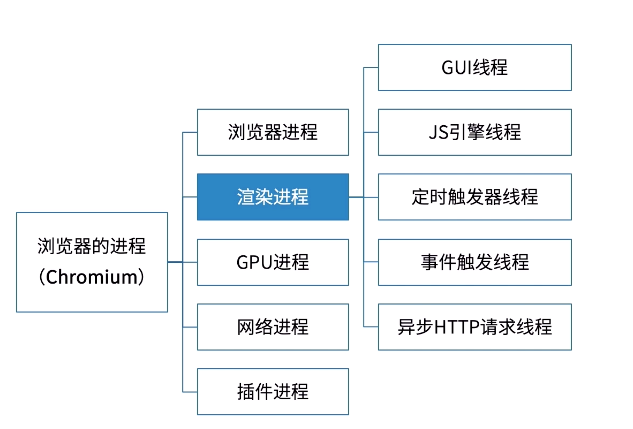
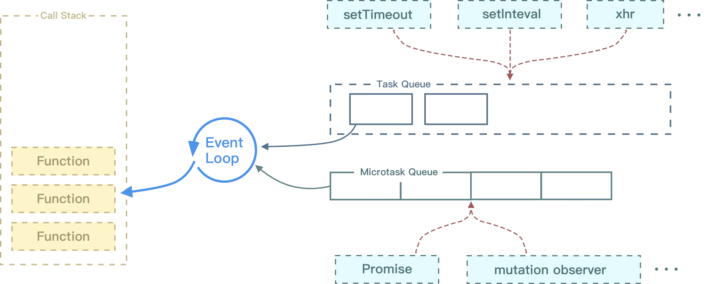

## 先了解浏览器的进程和线程
浏览器中打开新标签时，就会创建一个任务队列。每个标签都是单线程处理所有的任务。

浏览器要负责多个任务，如渲染HTML、执行JavaScript代码、处理用户交互（用 户输入、鼠标点击等）、执行和处理异步请求。

渲染进程（浏览器内核）是多线程的，也是浏览器的重点，因为页面的渲染，JS执行等都在这个进程内进行

浏览器是多进程的，浏览器每一个打开一个Tab页面都代表着创建一个独立的进程（至少需要四个，若页面有插件运行，则五个）。



### 渲染进程
1. GUI渲染线程
负责渲染浏览器界面,包括解析HTML，CSS，构建DOM树和RenderObject树，布局和绘制等。
当界面需要重绘（Repaint）或由于某种操作引发回流(reflow)时，该线程就会执行。
注意 : GUI渲染线程与JS引擎线程是互斥的。

2. JS引擎线程
也称为JS内核，负责解析处理Javascript脚本，运行代码。（例如V8引擎）。
JS引擎一直等待并处理任务队列中任务。一个Tab页中无论什么时候都只有一个JS线程在运行JS程序

3. 定时触发器线程
setInterval和setTimeout所在线程。通过此线程计时完毕后，添加到事件队列中，等待JS引擎空闲后执行

4. 事件触发线程
当一个事件被触发时该线程会把事件添加到事件队列，等待JS引擎的处理
这些事件可来自JS引擎当前执行的代码块如setTimeOut、也可来自浏览器内核的其他线程如鼠标点击、AJAX异步请求等，但由于JS的单线程关系所有这些事件都得排队等待JS引擎处理。

5. 异步http请求线程
在XMLHttpRequest连接后是通过浏览器新开一个线程请求。
将检测到状态变更时，如果设置有回调函数，异步线程就产生状态变更事件，将这个回调再放入事件队列中。再由JS引擎执行


## event loop
宏任务可以被看作是一个个独立的任务，而微任务则是宏任务中的一个子任务，它们的执行顺序是不同的。

在事件循环中，当执行一个宏任务时，假如有微任务会被推入微任务队列中，等待当前宏任务执行完毕后被执行。因为微任务的执行时机比宏任务早，所以在下一个宏任务开始执行之前，JavaScript 引擎会先处理所有的微任务，然后才会执行下一个宏任务。这样可以保证微任务的执行顺序比宏任务早。

定时器包括 setTimeout 和 setInterval 等都是属于宏任务的一种。这是因为它们的执行时机是由浏览器的事件循环控制的，而不是由 JavaScript 引擎控制的。

### 执行过程
1. 首先执行同步代码，这属于宏任务,执行过程中如果遇到微任务，就将它添加到微任务的任务队列中
```
先执行"最前面"的宏任务, 然后执行当前 loop 下所有的微任务, 所有微任务完毕之后, 进入下一次 loop, 执行接下来的宏任务, 重复上述过程。
所以也不能说先宏后微，执行完任务队列头的宏任务后就开始执行微任务队列中的微任务，直到微任务队列为空。
```
2. 当执行完所有`同步代码`后，执行栈为空，立即执行当前微任务队列中的所有微任务（依次执行）
宏任务结束后，会执行渲染，然后执行下一个宏任务，而微任务可以理解成在当前宏任务执行后立即执行的任务。
也就是说，当宏任务执行完，会在渲染前，将执行期间所产生的所有微任务都执行完。
```js
document.body.style = 'background:blue'
console.log(1);
Promise.resolve().then(()=>{    
  console.log(2);    
  document.body.style = 'background:black'
});
console.log(3);
// 1 3 2
```
3. 当前宏任务执行完毕，开始检查渲染，然后GUI线程接管渲染
4. 然后开始下一轮 Event Loop，开始下一轮tick，执行宏任务中的异步代码（setTimeout等回调）。

JS引擎线程和GUI渲染线程是互斥的关系，浏览器为了能够使宏任务和DOM任务有序的进行，会在一个宏任务执行结果后，在下一个宏任务执行前，GUI渲染线程开始工作，对页面进行渲染。

宏任务-->渲染-->宏任务-->渲染-->渲染．．．
主代码块，setTimeout，setInterval等，都属于宏任务

第一个例子：
我们可以将这段代码放到浏览器的控制台执行以下，看一下效果：
我们会看到的结果是，页面背景会在瞬间变成灰色，以上代码属于同一次宏任务，所以全部执行完才触发页面渲染，渲染时GUI线程会将所有UI改动优化合并，所以视觉效果上，只会看到页面变成灰色。
```js
document.body.style = 'background:black';
document.body.style = 'background:red';
document.body.style = 'background:blue';
document.body.style = 'background:grey';
```

第二个例子：
我会看到，页面先显示成red背景，然后瞬间变成了黑色背景，这是因为以上代码属于两次宏任务，第一次宏任务执行的代码是将背景变成red，然后触发渲染，将页面变成red，再触发第二次宏任务将背景变成黑色。

貌似看不到red,太快？
```js
document.body.style = 'background:red';
setTimeout(function() {
  document.body.style = 'background:black'
}, 0)
// }, 10000)
```

## 宏任务有哪些？
JavaScript中的宏任务是由浏览器或Node.js环境提供的任务队列，它们会在主线程空闲时执行。以下是常见的JS宏任务类型：

1. setTimeout 和 setInterval：在指定的时间间隔或延迟之后执行指定的函数。

2. I/O 操作：包括读取或写入文件、从网络加载数据等异步操作。

3. UI 交互事件：例如点击、滚动、鼠标移动等。

4. 页面渲染：在页面加载、重绘或者样式计算时执行的任务。

5. Ajax请求：通过XMLHttpRequest或fetch等方式异步获取数据的操作。

6. 原生事件：例如window.resize、window.scroll等。

7. requestAnimationFrame：在下一帧渲染之前执行的动画更新任务。

8. postMessage：通过MessageChannel或window.postMessage方法发送的异步消息。

## 微任务有哪些？
微任务是 JavaScript 引擎内部的任务，会在当前宏任务执行完毕后立即执行。常见的微任务有以下几种：

微任务会在当前宏任务执行完毕后，优先于下一个宏任务执行，因此可以用来在当前任务完成后立即执行一些需要尽早完成的任务，例如执行一些 DOM 更新操作，避免用户看到页面更新的延迟感。需要注意的是，由于微任务在执行顺序上的优先级比较高，如果不小心出现过多的微任务，可能会导致宏任务长时间得不到执行，从而导致页面卡顿的现象。

1. Promise:new Promise().then 的回调,promise构造函数是同步执行:new Promise中传入的执行器函数是同步函数,在ES5之后，JavaScript引入了Promise，这样，不需要浏览器，JavaScript引擎自身也能够发起异步任务了。
首先Promise构造函数会立即执行，而Promise.then()内部的代码在当次事件循环的结尾立即执行(微任务)。

2. MutationObserver 回调函数：监测 DOM 树变化的回调函数。

3. Object.observe()：监听对象变化的回调函数。

3. process.nextTick()：在 Node.js 中的异步任务队列。

4. queueMicrotask()：ES6 新增的微任务队列 API。

5. Vue nextTick 
```
api-nextTick.md
```


## JS到底是怎么运行的呢？
参考：[Parser解析](../Parser解析得到AST-Ignition解释得到字节码)

## 初始化-构造事件循环与消息队列
JS引擎常驻于内存中，等待宿主将JS代码或函数传递给它。也就是等待宿主环境分配宏观任务，反复等待 - 执行即为事件循环。


概念1：宿主
JS运行的环境:浏览器/Node。

概念2：执行栈,是一个存储函数调用的栈结构，遵循先进后出的原则。
```js
function foo() {
  throw new Error('error')
  console.log("test")
}
function bar() {
  foo()
}
bar()

以上代码会报错：
VM100:2 Uncaught Error: error
    at foo (<anonymous>:2:9)
    at bar (<anonymous>:5:3)
    at <anonymous>:7:1

当开始执行 JS 代码时，首先会执行一个 main 函数，然后执行我们的代码。根据先进后出的原则，后执行的函数会先弹出栈，在图中我们也可以发现，foo 函数后执行，当执行完毕后就从栈中弹出了。
```

## JS是单线程的，那么单线程的JS是怎么完成非阻塞的完成异任务的呢?-->事件循环
1. Node环境中，只有JS 线程。
2. 在浏览器环境中，有JS 引擎线程和渲染线程，且两个线程互斥。

js是单线程语言，浏览器只分配给js一个主线程，用来执行任务（函数），但一次只能执行一个任务，这些任务形成一个任务队列排队等候执行，但前端的某些任务是非常耗时的，比如网络请求，定时器和事件监听，如果让他们和别的任务一样，都老老实实的排队等待执行的话，执行效率会非常的低，甚至导致页面的假死。

所以，浏览器为这些耗时任务开辟了另外的线程，主要包括http请求线程，浏览器定时触发器，浏览器事件触发线程，这些任务是异步的。

那么问题来了，这些异步任务完成后，主线程怎么知道呢？

浏览器提供一些异步的WebAPI例如DOM操作，setTimeout，XHR等，JS通过事件循环机制（event loop）调用这些API的回调。答案就是回调函数，整个程序是事件驱动的，每个事件都会绑定相应的回调函数，举个例子，有段代码设置了一个定时器:
```js
setTimeout(function(){
    console.log(time is out);
}，1000）;
```
执行这段代码的时候，浏览器异步执行计时操作，当1000ms到了后，会触发定时事件，这个时候，就会把回调函数放到任务队列里。整个程序就是通过这样的一个个事件驱动起来的。
所以说，js是一直是单线程的，实现异步的是浏览器。

## event loop题目
### 经典案例
```js
for (var i=1; i<=5; i++) { 
    setTimeout( function timer() {
        console.log(i); //输出6 6 6 6 6 6
    }, i*1000 );
}
因为：根据setTimeout定义的操作在函数调用栈清空之后才会执行的特点，for循环里定义了5个setTimeout操作。而当这些操作开始执行时，for循环的i值，已经先一步变成了6。因此输出结果总为6。
```
### 解决：
而我们知道在函数中闭包判定的准则，即执行时是否在内部定义的函数中访问了上层作用域的变量。因此我们需要包裹一层自执行函数为闭包的形成提供条件。
因此，我们只需要2个操作就可以完成题目需求，一是使用自执行函数提供闭包条件，二是传入i值并保存在闭包中。

//而我们想要让输出结果依次执行，我们就必须借助闭包的特性，每次循环时，将i值保存在一个闭包中，当setTimeout中定义的操作执行时，则访问对应闭包保存的i值即可。
```js
for (var i=1; i<=5; i++) { 
    (function(i) {
        setTimeout( function timer() {
            console.log(i);
        }, i*1000 );
    })(i)
}
```
### 解析
```
这道题涉及了异步、作用域、闭包

 setTimeout是异步执行，10ms后往任务队列里面添加一个任务，只有主线上的全部执行完，才会执行任务队列里的任务，当主线执行完成后，i是4，所以此时再去执行任务队列里的任务时，i全部是4了。对于打印4次是：

 每一次for循环的时候，setTimeout都执行一次，但是里面的函数没有被执行，而是被放到了任务队列里面，等待执行，for循环了4次，就放了4次，当主线程执行完成后，才进入任务队列里面执行。

（注意：for循环从开始到结束的过程，需要维持几微秒或几毫秒。)

 当我把var 变成let 时

 for(let i=0;i<=3;i++){ setTimeout(function() {  console.log(i)  }, 10);}

 打印出的是：0,1,2,3

 当解决变量作用域，

 因为for循环头部的let不仅将i绑定到for循环快中，事实上它将其重新绑定到循环体的每一次迭代中，确保上一次迭代结束的值重新被赋值。setTimeout里面的function()属于一个新的域，通过 var 定义的变量是无法传入到这个函数执行域中的，通过使用 let 来声明块变量，这时候变量就能作用于这个块，所以 function就能使用 i 这个变量了；这个匿名函数的参数作用域 和 for参数的作用域 不一样，是利用了这一点来完成的。这个匿名函数的作用域有点类似类的属性，是可以被内层方法使用的。
```

## 简单的参考例子
```js
setTimeout(function() {
    console.log('timeout1');
})

new Promise(function(resolve) {
    console.log('promise1');
    for(var i = 0; i < 1000; i++) {
        i == 99 && resolve();
    }
    console.log('promise2');
}).then(function() {
    console.log('then1');
})

console.log('global1');
/*
    promise1
    promise2
    global1
    then1
    undefined
    timeout1
* */
```