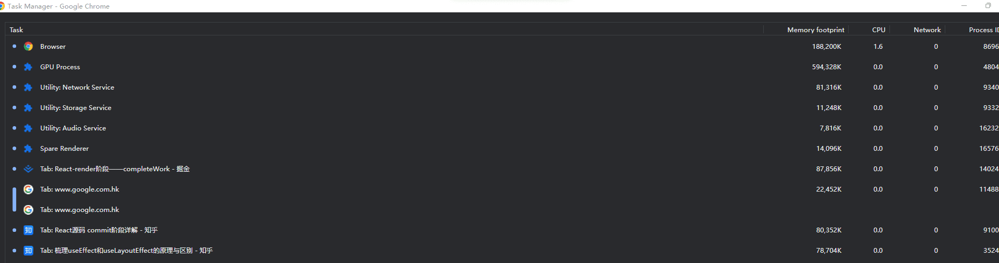
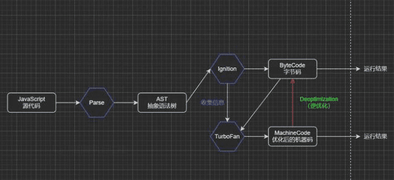
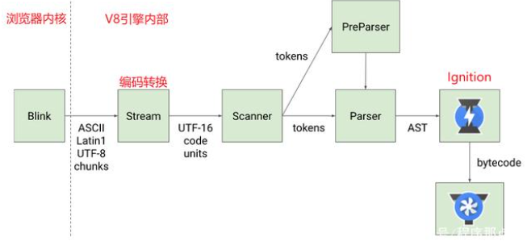

## 1. 进程和线程.每个进程（process）中又包含多个线程（thread），一个进程内的多个线程也会协同工作，配合完成所在进程的职责。
```
进程可以理解成正在执行的应用程序；一个进程里面可能有一个或者多个线程;

进程就像是一个有边界的生产厂间，而线程就像是厂间内的一个个员工，可以自己做自己的事情，也可以相互配合做同一件事情。

线程呢，可以理解成我们应用程序中的代码的执行器；而一个线程，只能隶属于一个进程。
```

当我们启动一个应用，计算机会创建一个进程，操作系统会为进程分配一部分内存，应用的所有状态都会保存在这块内存中，应用也许还会创建多个线程来辅助工作，这些线程可以共享这部分内存中的数据。如果应用关闭，进程会被终结，操作系统会释放相关内存。

启动的进程会创建另外的新的进程来处理其他任务，这些创建出来的新的进程拥有全新的独立的内存空间，不能与原来的进程内向内存，如果这些进程之间需要通信，可以通过IPC机制（Inter Process Communication）来进行

<br />

## 2. 浏览器的基本架构模式:多进程架构
Chrome为什么要使用多进程架构?
很多应用程序都会采取这种多进程的方式来工作，因为进程和进程之间是互相独立的它们互不影响.优点：
1. 容错性,有些BUG会直接导致渲染引擎崩溃，多进程架构使得每一个渲染引擎运行在各自的进程中，相互之间不受影响，也就是说，当其中一个页面崩溃挂掉之后，不影响其他

2. 更高的安全性和沙盒性：渲染引擎会经常性的在网络上遇到不可信、甚至是恶意的代码，它们会利用这些漏洞在你的电脑上安装恶意的软件，针对这一问题，浏览器对不同进程限制了不同的权限，并为其提供沙盒运行环境，

3. 更高的响应速度：在单进程的架构中，各个任务相互竞争抢夺CPU资源

浏览器的进程模式:

一个Tab，就会有一个Renderer Process，这些进程之间的内存无法进行共享，而不同进程的内存常常需要包含相同的内容。
为了节省内存，Chrome提供了四种进程模式,不同的进程模式会对 tab 进程做不同的处理。
1. Process-per-site-instance (default) - 同一个 site-instance 使用一个进程
2. Process-per-site - 同一个 site 使用一个进程
3. Process-per-tab - 每个 tab 使用一个进程
4. Single process - 所有 tab 共用一个进程

`在Chrome中，主要的进程有4个`：
* 1.浏览器进程 (Browser Process)：负责浏览器的TAB的前进、后退、地址栏、书签栏的工作和处理浏览器的一些不可见的底层操作，比如网络请求和文件访问。
```
1.负责包括地址栏，书签栏，前进后退按钮等部分的工作；
3.负责处理浏览器的一些不可见的底层操作，比如网络请求和文件访问；
```

* 2.`渲染进程 (Renderer Process)`：负责一个Tab内的显示相关的工作，也称渲染引擎。
```
负责一个 tab 内关于网页呈现的所有事情
```

* 3.插件进程 (Plugin Process)：负责控制网页使用到的插件
```
负责控制一个网页用到的所有插件，如 flash
```

* 4.GPU进程 (GPU Process)：负责处理整个应用程序的GPU任务
```
负责处理 GPU 相关的任务
```

注意：Chrome 还为我们提供了「任务管理器」，供我们方便的查看当前浏览器中运行的所有进程及每个进程占用的系统资源，右键单击还可以查看更多类别信息。 通过「页面右上角的三个点点点 --- 更多工具 --- 任务管理器」即可打开相关面板，




4个进程之间的关系
* 输入URL，这个时候(A)Browser Process会向这个URL发送请求，获取这个URL的HTML内容，

* 然后将HTML交给(B)Renderer Process，(B)Renderer Process解析HTML内容，解析遇到需要请求网络的资源又返回来交给(A)Browser Process进行加载，
同时通知(A)Browser Process，需要(C)Plugin Process加载插件资源，执行插件代码。解析完成后，

* (B)Renderer Process计算得到图像帧，并将这些图像帧交给(D)GPU Process，(D)GPU Process将其转化为图像显示屏幕。

<br />

## A. 实例：当我们在浏览器地址栏中输入，并点击回车获得页面内容的过程在浏览器看来可以分为以下几步：

### A-1.处理输入
```
UI thread 需要判断用户输入的是 URL 还是 query；
2.开始导航
当用户点击回车键，UI thread 通知 network thread 获取网页内容，并控制 tab 上的 spinner 展现，表示正在加载中。

network thread 会执行 DNS 查询，随后为请求建立 TLS 连接

如果 network thread 接收到了重定向请求头如 301，network thread 会通知 UI thread 服务器要求重定向，之后，另外一个 URL 请求会被触发。
```

### A-2. 读取响应
```
当请求响应返回的时候，network thread 会依据 Content-Type 及 MIME Type sniffing 判断响应内容的格式

如果响应内容的格式是 HTML ，下一步将会把这些数据传递给 renderer process，如果是 zip 文件或者其它文件，会把相关数据传输给下载管理器。

另外：
Safe Browsing 检查也会在此时触发，如果域名或者请求内容匹配到已知的恶意站点，network thread 会展示一个警告页。此外 CORB 检测也会触发确保敏感数据不会被传递给渲染进程。
```

### A-3.查找渲染进程
```
当上述所有检查完成，network thread 确信浏览器可以导航到请求网页，network thread 会通知 UI thread 数据已经准备好，UI thread 会查找到一个 renderer process 进行网页的渲染。
```
### A-4.确认导航
```
进过了上述过程，数据以及渲染进程都可用了， Browser Process 会给 renderer process 发送 IPC 消息来确认导航，一旦 Browser Process 收到 renderer process 的渲染确认消息，导航过程结束，页面加载过程开始。

此时，地址栏会更新，展示出新页面的网页信息。history tab 会更新，可通过返回键返回导航来的页面，为了让关闭 tab 或者窗口后便于恢复，这些信息会存放在硬盘中。
```

### A-5.额外的步骤
```
一旦导航被确认，renderer process 会使用相关的资源渲染页面，下文中我们将重点介绍渲染流程。当 renderer process 渲染结束（渲染结束意味着该页面内的所有的页面，包括所有 iframe 都触发了 onload 时），会发送 IPC 信号到 Browser process， UI thread 会停止展示 tab 中的 spinner。
```

### A-6.总结流程
```
当然上面的流程只是网页首帧渲染完成，在此之后，客户端依旧可下载额外的资源渲染出新的视图。

在这里我们可以明确一点，所有的 JS 代码其实都由 renderer Process 控制的，所以在你浏览网页内容的过程大部分时候不会涉及到其它的进程。不过也许你也曾经监听过 beforeunload 事件，这个事件再次涉及到 Browser Process 和 renderer Process 的交互，当当前页面关闭时（关闭 Tab ，刷新等等），Browser Process 需要通知 renderer Process 进行相关的检查，对相关事件进行处理。

如果导航由 renderer process 触发（比如在用户点击某链接，或者JS执行 `window.location = "http://newsite.com" ` ） renderer process 会首先检查是否有 `beforeunload` 事件处理器，导航请求由 renderer process 传递给 Browser process

如果导航到新的网站，会启用一个新的 render process 来处理新页面的渲染，老的进程会留下来处理类似 `unload` 等事件。


除了上述流程，有些页面还拥有 Service Worker （服务工作线程），Service Worker 让开发者对本地缓存及判断何时从网络上获取信息有了更多的控制权，如果 Service Worker 被设置为从本地 cache 中加载数据，那么就没有必要从网上获取更多数据了。

值得注意的是 service worker 也是运行在渲染进程中的 JS 代码，因此对于拥有 Service Worker 的页面，上述流程有些许的不同。

当有 Service Worker 被注册时，其作用域会被保存，当有导航时，network thread 会在注册过的 Service Worker 的作用域中检查相关域名，如果存在对应的 Service worker，UI thread 会找到一个 renderer process 来处理相关代码，Service Worker 可能会从 cache 中加载数据，从而终止对网络的请求，也可能从网上请求新的数据。
```

<br />

## 基础1：浏览器内核
浏览器最核心的部分是“Rendering Engine” , 浏览器内核分成两部分:
* 渲染引擎
```
渲染引擎是一种对HTML文档进行解析并将其显示在页面上的工具, 浏览器每新建一个标签页，相当于开启了一个新的进程（进程可以看作是一间工厂），这个进程会实例化js引擎等;（js引擎就是工厂里的一个工具人）
```
* js引擎:为什么需要JavaScript引擎？
```
JavaScript是一门高级编程语言，所有的高级编程语言都是需要转换成最终的机器指令来执行的；JS代码可以由浏览器或者Node执行，其底层最终都是交给CPU执行；

但是CPU只认识自己的指令集，也就是机器语言，而JavaScript引擎主要功能就是帮助我们将JavaScript代码翻译CPU所能认识指令，最终被CPU执行；

进行解析，这里就涉及到浏览器内核。
```

由于js引擎越来越独立，内核就倾向于只指渲染引擎。


### 基础1-1：不同的浏览器由不同的内核构成，常见的浏览器内核：
* Gecko： Firefox采用Gecko作为内核

* Trident：由微软开发的，IE浏览器一直在使用，但Edge浏览器内核已经转向了Blink

* Webkit：苹果基于KHTML开发，并且是开源的，用于Safari，Google Chrome浏览器早期也在使用

* Blink：Google基于Webkit开发的，是Webkit的一个分支，目前应用于Google Chrome、Edge、Opera等等
```
2013年，由于Webkit2和Chromium在沙箱设计上的冲突，谷歌联手Opera自研和发布了Blink引擎，逐步脱离了Webkit的影响。

Chromium扩展自Webkit止于Webkit2，其后Chrome切换到了Blink引擎。另外，Chrome的JS引擎使用的V8引擎，应该算是最著名和优秀的开源JS引擎，Node.js就是选用V8作为底层架构。

V8 对 DOM（文档对象模型）一无所知，因为它仅用于处理 JavaScript。
因为 Node.js 不需要使用 DOM，所以 Node.js 只使用了 V8 引擎。

Blink 内置的布局引擎负责处理网页布局和展示。
```


### 基础1-2：浏览器内核和JS引擎的关系
Blink 是 Google Chrome 浏览器的渲染引擎，V8 是 Blink 内置的 JavaScript 引擎。

这里以Webkit内核为例。

Webkit由两部分组成：
- WebCore：负责HTML解析、布局、渲染等相关的操作；
- JavaScriptCore（JSCore）：解析和执行JavaScript代码；

小程序中编写的JavaScript代码就是由JSCore执行的，也就是小程序使用的引擎就是JavaScriptCore：
渲染层：由Webview来解析和渲染wxml、wxss等；
逻辑层：由JSCore来解析和执行JS代码；

<br />

## 页面渲染完毕，JavaScript代码由谁来执行呢？
下面该JavaScript引擎出场了

## 基础2：V8引擎
先了解一下官方对V8引擎的定义：
V8引擎使用C++编写的Google开源高性能JavaScript和WebAssembly引擎，它用于Chrome和Node.js等，可以独立运行，也可以嵌入到任何C++的应用程序中。

所以说V8并不单单只是服务于JavaScript的，还可以用于WebAssembly（一种用于基于堆栈的虚拟机的二进制指令格式），并且可以运行在多个平台。

下图简单的展示了V8的底层架构：


### 基础2-1.V8引擎的架构
V8的底层架构主要有三个核心模块（Parse、Ignition和TurboFan），接下来对上面架构图进行详细说明

### 基础2-2.Parse模块：将JavaScript代码转换成AST（抽象语法树）。
该过程主要对JavaScript源代码进行词法分析和语法分析；

词法分析：对代码中的每一个词或符号进行解析，最终会生成很多tokens（一个数组，里面包含很多对象）；

比如，对const name = 'curry'这一行代码进行词法分析：
```
// 首先对const进行解析，因为const为一个关键字，所以类型会被记为一个关键词，值为consttokens: [  { type: 'keyword', value: 'const' }]// 接着对name进行解析，因为name为一个标识符，所以类型会被记为一个标识符，值为nametokens: [  { type: 'keyword', value: 'const' },  { type: 'identifier', value: 'name' }]// 以此类推...
```

语法分析：在词法分析的基础上，拿到tokens中的一个个对象，根据它们不同的类型再进一步分析具体语法，最终生成AST；

以上即为简单的JS词法分析和语法分析过程介绍，如果想详细查看我们的JavaScript代码在通过Parse转换后的AST，可以使用AST Explorer工具
AST在前端应用场景特别多，比如将TypeScript代码转成JavaScript代码、ES6转ES5、还有像vue中的template等，都是先将其转换成对应的AST，然后再生成目标代码；

参考官方文档：https://v8.dev/blog/scanner

### 基础2-3.Ignition模块：一个解释器，可以将AST转换成ByteCode（字节码）。
字节码（Byte-code）：是一种包含执行程序，由一序列 op 代码/数据对组成的二进制文件，是一种中间码。

将JS代码转成AST是便于引擎对其进行操作，前面说到JS代码最终是转成机器码给CPU执行的，为什么还要先转换成字节码呢？

因为JS运行所处的环境是不一定的，可能是windows或Linux或iOS，不同的操作系统其CPU所能识别的机器指令也是不一样的。字节码是一种中间码，本身就有跨平台的特性，然后V8引擎再根据当前所处的环境将字节码编译成对应的机器指令给当前环境的CPU执行。

参考官方文档：https://v8.dev/blog/ignition-interpreter

### 基础2-4.TurboFan模块：一个编译器，可以将字节码编译为CPU认识的机器码。
在了解TurboFan模块之前可以先考虑一个问题，如果每执行一次代码，就要先将AST转成字节码然后再解析成机器指令，是不是有点损耗性能呢？强大的V8早就考虑到了，所以出现了TurboFan这么一个库；

TurboFan可以获取到Ignition收集的一些信息，如果一个函数在代码中被多次调用，那么就会被标记为热点函数，然后经过TurboFan转换成优化的机器码，再次执行该函数的时候就直接执行该机器码，提高代码的执行性能；

图中还存在一个Deoptimization过程，其实就是机器码被还原成ByteCode，比如，在后续执行代码的过程中传入热点函数的参数类型发生了变化（如果给sum函数传入number类型的参数，那么就是做加法；如果给sum函数传入String类型的参数，那么就是做字符串拼接），可能之前优化的机器码就不能满足需求了，就会逆向转成字节码，字节码再编译成正确的机器码进行执行；

从这里就可以发现，如果在编写代码时给函数传递固定类型的参数，是可以从一定程度上优化我们代码执行效率的，所以TypeScript编译出来的JavaScript代码的性能是比较好的；

参考官方文档：https://v8.dev/blog/turbofan-jit

### 基础2-5.V8引擎执行过程
V8引擎的官方在Parse过程提供了以下这幅图，最后就来详细了解一下Parse具体的执行过程。



* 1.Blink内核将JS源码交给V8引擎；

* 2.Stream获取到JS源码进行编码转换；

* 3.Scanner进行词法分析，将代码转换成tokens；

* 4.经过语法分析后，tokens会被转换成AST，中间会经过Parser和PreParser过程：

因为并不是所有的JavaScript代码，在一开始时就会执行的，如果一股脑对所有JavaScript代码进行解析，必然会影响性能，所以V8就实现了Lazy Parsing（延迟解析）方案，对不必要的函数代码进行预解析，也就是先解析急需要执行的代码内容，对函数的全量解析会放到函数被调用时进行。

Parser：直接解析，将tokens转成AST树；

PreParser：预解析（为什么需要预解析？）

* 5.生成AST后，会被Ignition转换成字节码，然后转成机器码，最后就是代码的执行过程了；

### 基础2-6.js引擎执行机制如下：
```
查看：
04-1-浏览器event loop.md
```
* 1.所有同步任务都在主线程上，形成一个执行栈。

* 2.主线程外，还有一个task queue，只要异步任务有了运行结果，就在task queue中放置一个事件。

* 3.当执行栈所有同步任务之行结束后，系统会读取 task queue，看看里面有哪些事件，于是这些异步任务，结束等待状态，进入执行栈，开始执行。

* 4.主线程不断重复第三步。

<br />

# C.渲染进程是如何工作的
```
渲染进程几乎负责 Tab 内的所有事情，渲染进程的核心目的在于转换 HTML CSS JS 为用户可交互的 web 页面。
```

渲染进程中主要包含以下线程：
* 主线程 Main thread
* 工作线程 Worker thread
* 排版线程 Compositor thread
* 光栅线程 Raster thread

### C-1.构建 DOM
```
当渲染进程接收到导航的确认信息，开始接受 HTML 数据时，主线程会解析文本字符串为 DOM。
渲染 html 为 DOM 的方法由 HTML Standard 定义。

https://html.spec.whatwg.org/
```
### C-2.加载次级的资源
```
网页中常常包含诸如图片，CSS，JS 等额外的资源，这些资源需要从网络上或者 cache 中获取。主进程可以在构建 DOM 的过程中会逐一请求它们，为了加速 preload scanner 会同时运行，如果在 html 中存在 `` `<link>` 等标签，preload scanner 会把这些请求传递给 Browser process 中的 network thread 进行相关资源的下载。
```
### C-3.JS 的下载与执行
```
当遇到 `<script>` 标签时，渲染进程会停止解析 HTML，而去加载，解析和执行 JS 代码，停止解析 html 的原因在于 JS 可能会改变 DOM 的结构（使用诸如 `document.write()`等API）。

不过开发者其实也有多种方式来告知浏览器应对如何应对某个资源，比如说如果在`<script>` 标签上添加了 `async` 或 `defer` 等属性，浏览器会异步的加载和执行JS代码，而不会阻塞渲染。
```

```
defer:这个属性的用途是表明脚本在执行时不会影响页面的构造。也就是说，脚本会被延迟到整个页面都解析完毕后再运行。因此，在<script>元素中设置defer属性，相当于告诉浏览器立即下载，但延迟执行。


async:这个属性与defer类似，都用于改变处理脚本的行为。同样与defer类似，async只适用于外部脚本文件，并告诉浏览器立即下载文件。但与defer不同的是，标记为async的脚本并不保证按照它们的先后顺序执行。
第二个脚本文件可能会在第一个脚本文件之前执行。因此确保两者之间互不依赖非常重要。指定async属性的目的是不让页面等待两个脚本下载和执行，从而异步加载页面其他内容。
```

```
来看看chrome是怎么做的:
《WebKit技术内幕》：

1.当用户输入网页URL的时候，WebKit调用其资源加载器加载该URL对应的网页。

2.加载器依赖网络模块建立连接，发送请求并接受答复。

3.WebKit接收到各种网页或者资源的数据，其中某些资源可能是同步或异步获取的。

4.网页被交给HTML解释器转变成一系列的词语（Token）。

5.解释器根据词语构建节点（Node），形成DOM树。

6.如果节点是JavaScript代码的话，调用JavaScript引擎解释并执行。

7.JavaScript代码可能会修改DOM树的结构。

8.如果节点需要依赖其他资源，例如图片、CSS、视频等，调用资源加载器来加载他们，但是他们是异步的，不会阻碍当前DOM树的继续创建；如果是JavaScript资源URL（没有标记异步方式），则需要停止当前DOM树的创建，直到JavaScript的资源加载并被JavaScript引擎执行后才继续DOM树的创建。


所以，通俗来讲，chrome浏览器首先会请求HTML文档，然后对其中的各种资源调用相应的资源加载器进行异步网络请求，同时进行DOM渲染，直到遇到<script>标签的时候，主进程才会停止渲染等待此资源加载完毕然后调用V8引擎对js解析，继而继续进行DOM解析。我的理解如果加了async属性就相当于单独开了一个进程去独立加载和执行，而defer是和将<script>放到<body>底部一样的效果。
```

### C-4.样式计算
```
仅仅渲染 DOM 还不足以获知页面的具体样式，主进程还会基于 CSS 选择器解析 CSS 获取每一个节点的最终的计算样式值。即使不提供任何 CSS，浏览器对每个元素也会有一个默认的样式。
```
### C-5. 获取布局
```
想要渲染一个完整的页面，除了获知每个节点的具体样式，还需要获知每一个节点在页面上的位置，布局其实是找到所有元素的几何关系的过程。其具体过程如下：

通过遍历 DOM 及相关元素的计算样式，主线程会构建出包含每个元素的坐标信息及盒子大小的布局树。布局树和 DOM 树类似，但是其中只包含页面可见的元素，如果一个元素设置了 `display:none` ，这个元素不会出现在布局树上，伪元素虽然在 DOM 树上不可见，但是在布局树上是可见的。
```

### C-6. 绘制各元素
```
即使知道了不同元素的位置及样式信息，我们还需要知道不同元素的绘制先后顺序才能正确绘制出整个页面。在绘制阶段，主线程会遍历布局树以创建绘制记录。绘制记录可以看做是记录各元素绘制先后顺序的笔记。
```
### C-7.合成帧
```
熟悉 PS 等绘图软件的童鞋肯定对图层这一概念不陌生，现代 Chrome 其实利用了这一概念来组合不同的层。

复合是一种分割页面为不同的层，并单独栅格化，随后组合为帧的技术。不同层的组合由 compositor 线程（合成器线程）完成。

主线程会遍历布局树来创建层树（layer tree），添加了 `will-change` CSS 属性的元素，会被看做单独的一层，


你可能会想给每一个元素都添加上 `will-change`，不过组合过多的层也许会比在每一帧都栅格化页面中的某些小部分更慢。为了更合理的使用层，可参考 坚持仅合成器的属性和管理层计数 。

一旦层树被创建，渲染顺序被确定，主线程会把这些信息通知给合成器线程，合成器线程会栅格化每一层。有的层的可以达到整个页面的大小，因此，合成器线程将它们分成多个磁贴，并将每个磁贴发送到栅格线程，栅格线程会栅格化每一个磁贴并存储在 GPU 显存中。

合成器的优点在于，其工作无关主线程，合成器线程不需要等待样式计算或者 JS 执行，这就是为什么合成器相关的动画 最流畅，如果某个动画涉及到布局或者绘制的调整，就会涉及到主线程的重新计算，自然会慢很多。
```

### C-7.浏览器对事件的处理
```
04-2-浏览器对事件的处理.md
```
