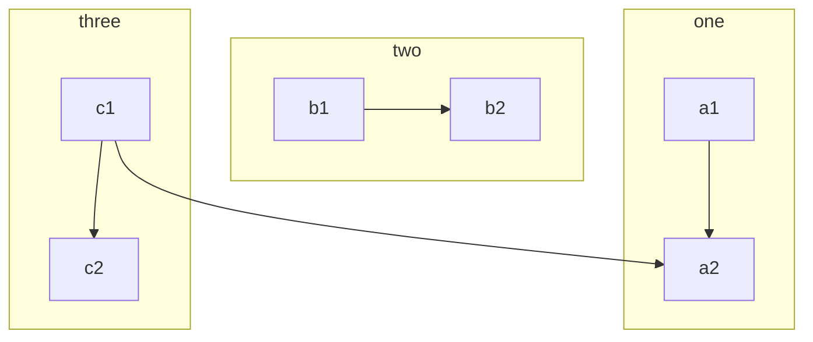
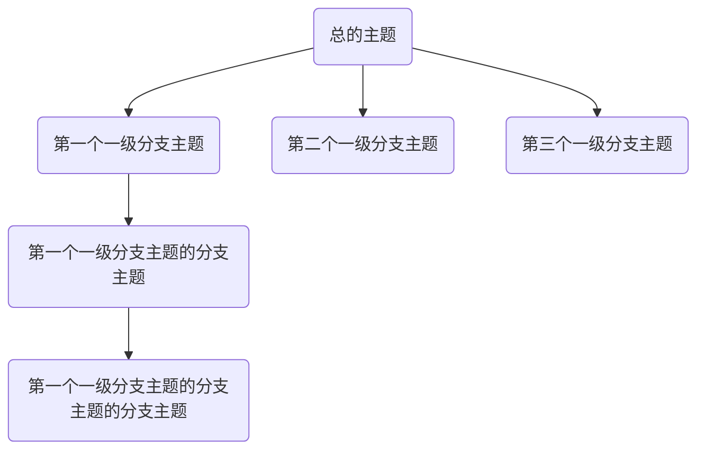

## 总文档
```
https://mermaid-js.github.io/mermaid/#/flowchart

git:
https://github.com/mermaid-js/mermaid/blob/develop/README.zh-CN.md
```

## 方向：用于开头，声明流程图的方向。
- graph或graph TB或graph TD：从上往下
- graph BT：从下往上
- graph LR：从左往右
- graph RL：从右往左

## 线
```
线的样式	含义
–>	带箭头的实线（短线越多线越长）
---->	中间可以添加文字
—	不带箭头的实线（短线越多线越长）
— —	中间可以添加文字
- . -	虚线 （虚线不能延长）
- . ->	虚线 （不能延长）
-.- -.->	中间可以添加文字 （不能延长）
==>	带箭头的粗线（可延长）
===	粗线 （可延长）
====>	中间可以添加文字（可延长）
======	中间可以添加文字（可延长）
```

## Mermaid能绘制哪些图？
- 饼状图：使用pie关键字，具体用法后文将详细介绍
- 流程图：使用graph关键字，具体用法后文将详细介绍
- 序列图：使用sequenceDiagram关键字
- 甘特图：使用gantt关键字
- 类图：使用classDiagram关键字
- 状态图：使用stateDiagram关键字
- 用户旅程图：使用journey关键字


## 子图


## 比较好阅读的例子
