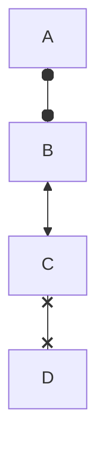
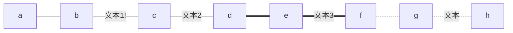
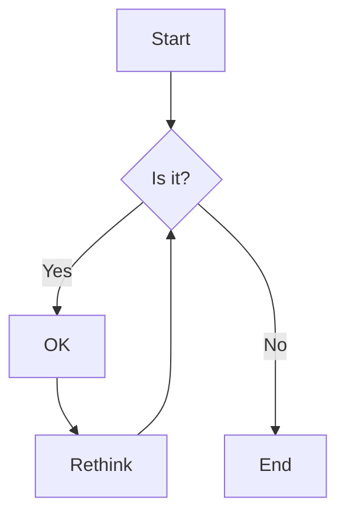

https://cloud.tencent.com/developer/article/1334691
## 无箭头线

```mermaid
flowchart TD
    A o--o B
    B <--> C
    C x--x D
```

## 其他连线：
虚线，箭头，无文字:
A-.->B;

虚线，箭头，文字
A-. text .-> B

```mermaid
graph LR
a---b
b--文本1!---c
c---|文本2|d
d===e
e==文本3===f
f-.-g
g-.文本.-h
```

## 延长连线：
增加相应字符即可，如下图中的B到E，连线中增加了一个-。字符可多次添加。

```mermaid
flowchart TD
%% A1graph LR
    A[Start] --> B{Is it?};
    B -->|Yes| C[OK];
    C --> D[Rethink];
    D --> B;
    B --->|No| E[End];
```
