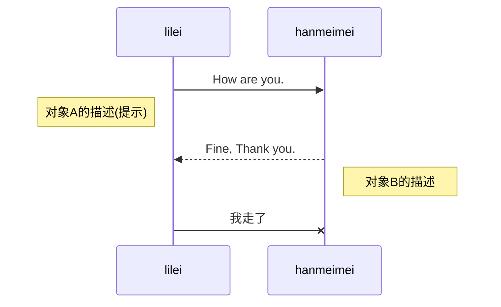
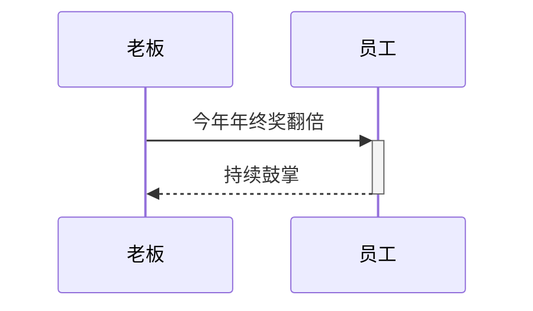
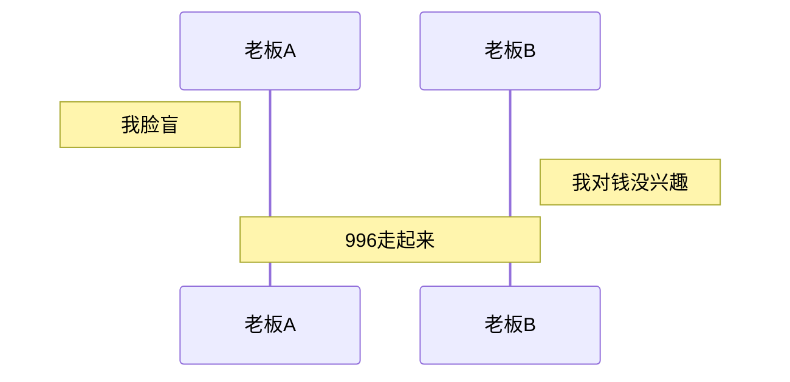
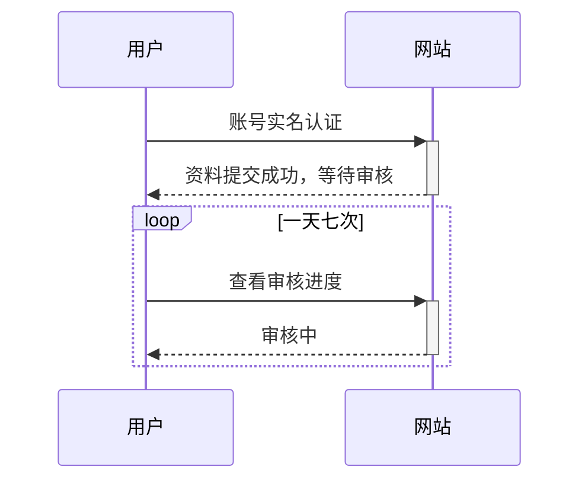

## 时序图
参与者
participant [别名 as ]《参与者名称》

消息
交互时一方对另一方的操作（比如接口调用）或传递出的信息。

->> 显示为实线箭头（主动发出消息）
-->> 显示为虚线箭头（响应）
-x 显示为末尾带「X」的实线箭头（异步消息）

消息语句格式为：

<参与者> <箭头> <参与者> : <描述文本>。

激活框
从消息接收方的时间线上标记一小段时间，表示对消息进行处理的时间间隔。

<参与者> <箭头> [+/-]: <描述文本>。

注解

循环
