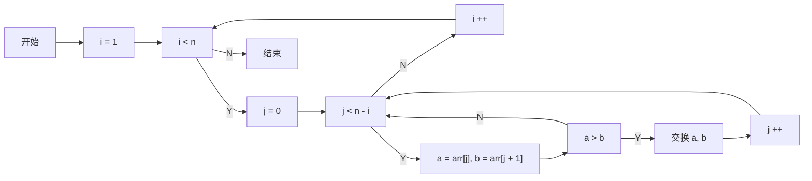
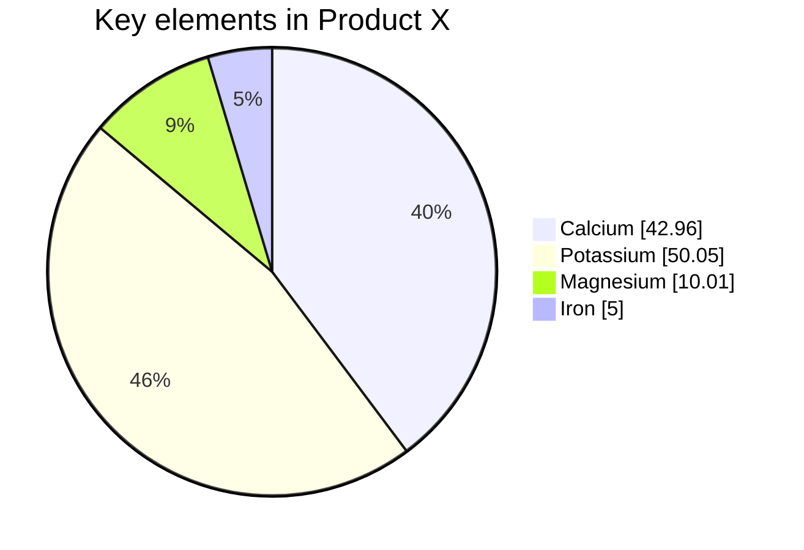

## 画二叉树
```mermaid
graph TB
A((A)) 		%%(())代表圆
B((B))
C((C))
D((D))
E((E))

A---B
A---C
B---F(( ))  %%F中为空字符
style F fill:#f100,stroke-width:0px %% 设置F属性为填充为白色，边框宽度为0
B---D
C---E
C---G(( ))   %%G中为空字符

style G fill:#f100,stroke-width:0px %% 设置F属性为填充为白色，边框宽度为0
linkStyle 2 stroke:#0ff,stroke-width:0px %%将第3条连接线的宽度设为0,就看不见这条线了
linkStyle 5 stroke:#0ff,stroke-width:0px;%%将第l6条连接线的宽度设为0,就看不见这条线了
```

